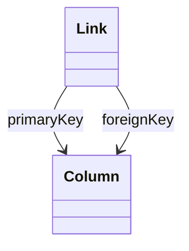

# Link

Defines a foreign key relationship between two database tables, establishing referential integrity constraints that are essential for dimensional modeling in OLAP systems. Links connect fact tables to dimension tables, enabling proper join relationships for star and snowflake schema implementations.
## Extends

## Attributes

<table>
  <thead>
    <tr>
      <th>Name</th>
      <th>Id</th>
      <th>Typ</th>
      <th>Lower</th>
      <th>Upper</th>
    </tr>
  </thead>
  <tbody>
  </tbody>
</table>

## References

<table>
  <thead>
    <tr>
      <th>Name</th>
      <th>Typ</th>
      <th>Lower</th>
      <th>Upper</th>
      <th>Containment</th>
    </tr>
  </thead>
  <tbody>
    <tr>
      <td><strong>primaryKey</strong></td>
      <td>Column<a href="./class-Column">🔗</a></td>
      <td>1</td>
      <td>1</td>
      <td>false</td>
    </tr>
    <tr>
      <td colspan="5"><em>Reference to the primary key column in the target dimension table. This column serves as the unique identifier that foreign key columns reference to establish table relationships in the dimensional model.</em></td>
    </tr>
    <tr>
      <td><strong>foreignKey</strong></td>
      <td>Column<a href="./class-Column">🔗</a></td>
      <td>1</td>
      <td>1</td>
      <td>false</td>
    </tr>
    <tr>
      <td colspan="5"><em>Reference to the foreign key column in the source table (typically a fact table) that points to the primary key in the target dimension table. This column contains dimension key values that enable joins between fact and dimension tables.</em></td>
    </tr>
  </tbody>
</table>

## Used by

- DatabaseCatalog[🔗](./class-DatabaseCatalog) → links
- Column[🔗](./class-Column) → primaryLinks
- Column[🔗](./class-Column) → foreignLinks

## ClassDiagramm

