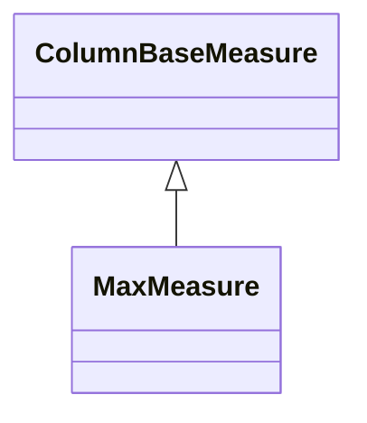

# MaxMeasure

A measure that calculates the maximum value from the referenced column across the aggregated data set. MaxMeasure uses the SQL MAX() aggregate function to find the largest value in the grouped data, making it ideal for metrics like highest price, latest date, peak temperature, or largest quantity. The measure provides non-additive aggregation behavior, meaning the maximum of a set of maximums is simply the overall maximum value. This measure type supports fast database-optimized aggregation and is commonly used for performance tracking, capacity planning, and threshold monitoring.
## Extends
- ColumnBaseMeasure [🔗](./class-ColumnBaseMeasure)
## Attributes

<table>
  <thead>
    <tr>
      <th>Name</th>
      <th>Id</th>
      <th>Typ</th>
      <th>Lower</th>
      <th>Upper</th>
    </tr>
  </thead>
  <tbody>
  </tbody>
</table>

## References

<table>
  <thead>
    <tr>
      <th>Name</th>
      <th>Typ</th>
      <th>Lower</th>
      <th>Upper</th>
      <th>Containment</th>
    </tr>
  </thead>
  <tbody>
  </tbody>
</table>

## Used by

## ClassDiagramm

