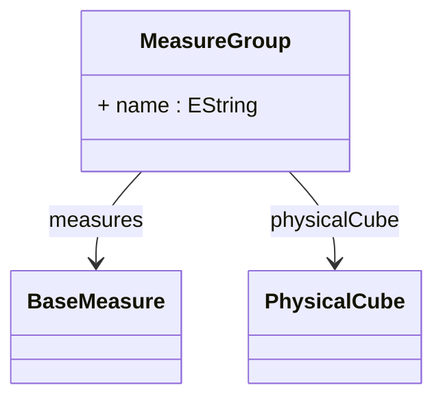

# MeasureGroup

A logical container that organizes related measures within a physical cube, providing grouping for measures that share common characteristics, business context, or data sources. MeasureGroup serves as both an organizational and metadata management mechanism, enabling better structure for complex cubes with many measures. For example, a sales cube might have separate measure groups for 'Revenue Metrics' (containing sales amounts, discounts, taxes) and 'Volume Metrics' (containing quantities, units, counts). Each measure group belongs to exactly one physical cube and contains one or more measures that are processed and displayed together in OLAP clients and XMLA metadata.
## Extends

## Attributes

<table>
  <thead>
    <tr>
      <th>Name</th>
      <th>Id</th>
      <th>Typ</th>
      <th>Lower</th>
      <th>Upper</th>
    </tr>
  </thead>
  <tbody>
    <tr>
      <td><strong>name</strong></td>
      <td>false</td>
      <td><em>EString</em></td>
      <td>0</td>
      <td>1</td>
    </tr>
    <tr>
      <td colspan="5"><em>Display name for this measure group that appears in OLAP clients, cube browsers, and metadata discovery. The name should clearly indicate the business purpose or theme of the grouped measures, such as 'Sales Metrics', 'Financial KPIs', or 'Inventory Measures'. This name helps users understand the logical organization of measures and appears in XMLA metadata and client tool measure lists.</em></td>
    </tr>
  </tbody>
</table>

## References

<table>
  <thead>
    <tr>
      <th>Name</th>
      <th>Typ</th>
      <th>Lower</th>
      <th>Upper</th>
      <th>Containment</th>
    </tr>
  </thead>
  <tbody>
    <tr>
      <td><strong>measures</strong></td>
      <td>BaseMeasure<a href="./class-BaseMeasure">🔗</a></td>
      <td>1</td>
      <td>&infin;</td>
      <td>true</td>
    </tr>
    <tr>
      <td colspan="5"><em>Collection of measures that belong to this measure group. Each measure represents a quantitative fact that can be analyzed and aggregated in OLAP queries, such as sales amounts, quantities, costs, or counts. The measures share common grouping characteristics and are often related by business context or data source. At least one measure is required per measure group, and all measures inherit the group's organizational and metadata properties. Measures can be of various types including sum, average, min, max, count, or custom aggregations.</em></td>
    </tr>
    <tr>
      <td><strong>physicalCube</strong></td>
      <td>PhysicalCube<a href="./class-PhysicalCube">🔗</a></td>
      <td>1</td>
      <td>1</td>
      <td>false</td>
    </tr>
    <tr>
      <td colspan="5"><em>Reference to the physical cube that contains this measure group. This establishes the bidirectional relationship between the cube and its measure groups, enabling the cube to organize its measures into logical groups while allowing the measure group to access cube-level properties and configurations. Each measure group belongs to exactly one physical cube and contributes to that cube's analytical capabilities.</em></td>
    </tr>
  </tbody>
</table>

## Used by

- PhysicalCube[🔗](./class-PhysicalCube) → measureGroups
- BaseMeasure[🔗](./class-BaseMeasure) → measureGroup

## ClassDiagramm

