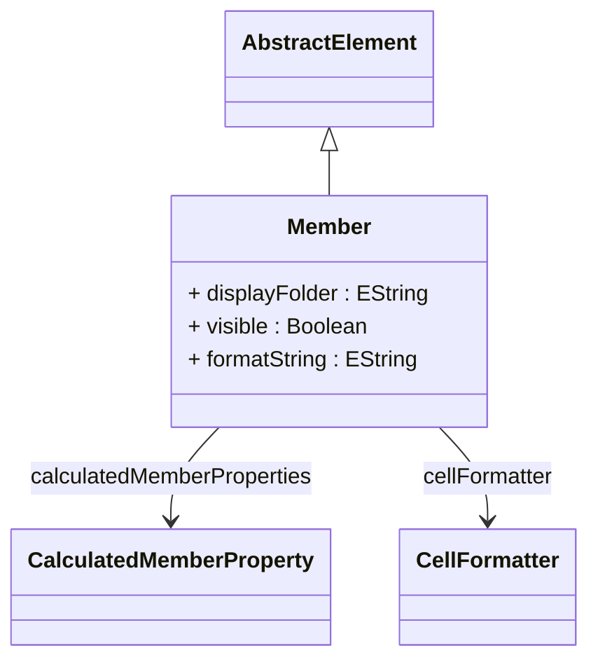

# Member

Abstract base class representing a member in the OLAP multidimensional model. A Member is a specific point or value within a dimension that can be used for slicing, dicing, and filtering data in analytical queries. Members exist within hierarchies and levels, forming the navigational structure that users traverse when exploring data. Examples include [Time].[1997].[January], [Customer].[USA].[California], or [Measures].[Sales Amount]. Members can have parent-child relationships, properties, and various types including regular dimensional values, calculated formulas, or special system members like All members. This abstract class provides the foundation for both regular dimension members and measures, which are special members of the [Measures] dimension.
## Extends
- AbstractElement [🔗](./class-AbstractElement)
## Attributes

<table>
  <thead>
    <tr>
      <th>Name</th>
      <th>Id</th>
      <th>Typ</th>
      <th>Lower</th>
      <th>Upper</th>
    </tr>
  </thead>
  <tbody>
    <tr>
      <td><strong>displayFolder</strong></td>
      <td>false</td>
      <td><em>EString</em></td>
      <td>0</td>
      <td>1</td>
    </tr>
    <tr>
      <td colspan="5"><em>Optional folder path that organizes this member within client tool hierarchies and measure lists. Display folders create logical groupings in OLAP client interfaces, helping users navigate large numbers of measures and calculated members. For example, 'Financial\\Profitability' or 'Operations\\Quality Metrics'. The folder structure appears in tools like Excel pivot tables and cube browsers.</em></td>
    </tr>
    <tr>
      <td><strong>visible</strong></td>
      <td>false</td>
      <td><em>Boolean</em></td>
      <td>0</td>
      <td>1</td>
    </tr>
    <tr>
      <td colspan="5"><em>Boolean flag controlling whether this member appears in client tool member lists, XMLA metadata discovery, and cube browsers. When set to false, the member becomes hidden from normal user interfaces but remains accessible through direct references in MDX queries. This is useful for creating internal system members, intermediate calculation steps, or advanced members intended only for power users who know the member names explicitly.</em></td>
    </tr>
    <tr>
      <td><strong>formatString</strong></td>
      <td>false</td>
      <td><em>EString</em></td>
      <td>0</td>
      <td>1</td>
    </tr>
    <tr>
      <td colspan="5"><em>Format string that defines how values for this member should be displayed in client applications. Uses standard formatting syntax for numbers, currencies, dates, and percentages (e.g., '#,##0.00', '$#,##0', 'yyyy-MM-dd', '0.0%'). This formatting is applied consistently across all OLAP clients and XMLA-compliant tools, ensuring uniform data presentation regardless of the client application being used.</em></td>
    </tr>
  </tbody>
</table>

## References

<table>
  <thead>
    <tr>
      <th>Name</th>
      <th>Typ</th>
      <th>Lower</th>
      <th>Upper</th>
      <th>Containment</th>
    </tr>
  </thead>
  <tbody>
    <tr>
      <td><strong>calculatedMemberProperties</strong></td>
      <td>CalculatedMemberProperty<a href="./class-CalculatedMemberProperty">🔗</a></td>
      <td>0</td>
      <td>&infin;</td>
      <td>true</td>
    </tr>
    <tr>
      <td colspan="5"><em>Collection of calculated member properties that provide additional metadata and computed values for this member. These properties extend the member with custom attributes that can be derived through MDX expressions, such as formatted display names, conditional formatting rules, or business logic calculations. Calculated member properties are particularly useful for measures and calculated members where dynamic property values enhance the analytical experience.</em></td>
    </tr>
    <tr>
      <td><strong>cellFormatter</strong></td>
      <td>CellFormatter<a href="./class-CellFormatter">🔗</a></td>
      <td>0</td>
      <td>1</td>
      <td>false</td>
    </tr>
    <tr>
      <td colspan="5"><em>Reference to a cell formatter that controls how values associated with this member are displayed in client applications. The formatter defines number formatting, currency symbols, date formats, and other presentation rules that ensure consistent and appropriate display of this member's data across different analytical tools and reports.</em></td>
    </tr>
  </tbody>
</table>

## Used by

- Cube[🔗](./class-Cube) → defaultMeasure

## ClassDiagramm

