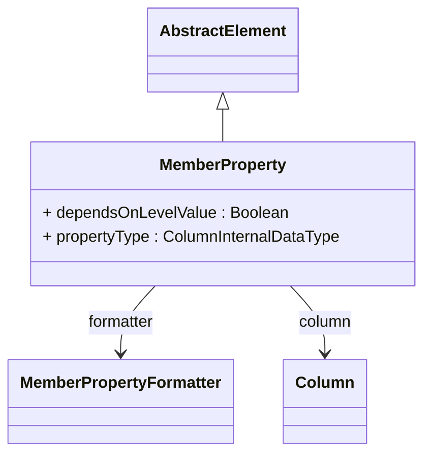

# MemberProperty

Defines an additional attribute that can be associated with dimension members to provide supplementary information beyond the basic member identification, naming, and captioning. Member properties enable rich analytical capabilities by exposing detailed member characteristics such as demographic data, geographic coordinates, financial metrics, temporal attributes, or any domain-specific descriptive information. These properties are fully integrated into the OLAP infrastructure, appearing in MDX query results, client tool member browsers, and XMLA metadata discovery.

## Extends
- AbstractElement [🔗](./class-AbstractElement)
## Attributes

<table>
  <thead>
    <tr>
      <th>Name</th>
      <th>Id</th>
      <th>Typ</th>
      <th>Lower</th>
      <th>Upper</th>
    </tr>
  </thead>
  <tbody>
    <tr>
      <td><strong>dependsOnLevelValue</strong></td>
      <td>false</td>
      <td><em>Boolean</em></td>
      <td>0</td>
      <td>1</td>
    </tr>
    <tr>
      <td colspan="5"><em>Boolean flag indicating whether this property value is functionally dependent on the level member key, meaning that each unique member key determines exactly one property value. When true, this optimization hint allows the OLAP engine to exclude the property column from GROUP BY clauses in generated SQL, improving query performance by reducing the number of grouping columns. This flag should only be set to true when there is a guaranteed one-to-one relationship between the level key and property value, such as when the property comes from the same table as the level key or from a properly normalized lookup table.</em></td>
    </tr>
    <tr>
      <td><strong>propertyType</strong></td>
      <td>false</td>
      <td><em>ColumnInternalDataType<a href="./enum-ColumnInternalDataType">🔗</a></em></td>
      <td>0</td>
      <td>1</td>
    </tr>
    <tr>
      <td colspan="5"><em>Data type of the property values, essential for proper SQL generation, comparison operations, sorting behavior, and display formatting. Supported types include STRING for text values, INTEGER and NUMERIC for numerical data, BOOLEAN for true/false values, DATE/TIME/TIMESTAMP for temporal data, and other specialized types. The property type determines how values are compared in filters, how they are formatted for display, what aggregation functions are applicable, and how they are serialized in XMLA responses and MDX query results.</em></td>
    </tr>
  </tbody>
</table>

## References

<table>
  <thead>
    <tr>
      <th>Name</th>
      <th>Typ</th>
      <th>Lower</th>
      <th>Upper</th>
      <th>Containment</th>
    </tr>
  </thead>
  <tbody>
    <tr>
      <td><strong>formatter</strong></td>
      <td>MemberPropertyFormatter<a href="./class-MemberPropertyFormatter">🔗</a></td>
      <td>0</td>
      <td>1</td>
      <td>true</td>
    </tr>
    <tr>
      <td colspan="5"><em>Optional custom formatter that controls how property values are displayed in client tools, reports, and user interfaces. The formatter can implement complex display logic including conditional formatting based on property values, custom string transformations, localized number and date formatting, unit conversions, or specialized business logic for domain-specific display requirements. When not specified, properties use default formatting based on their data type.</em></td>
    </tr>
    <tr>
      <td><strong>column</strong></td>
      <td>Column<a href="./class-Column">🔗</a></td>
      <td>1</td>
      <td>1</td>
      <td>false</td>
    </tr>
    <tr>
      <td colspan="5"><em>Database column or SQL expression that provides the property values for members at the associated level. This column must be accessible through the level's query context and should contain values that correspond to each member identified by the level's key column. The column can reference any table or view that is joined or accessible within the dimension's query structure, enabling properties to be sourced from lookup tables, calculated expressions, or denormalized dimension tables.</em></td>
    </tr>
  </tbody>
</table>

## Used by

- Level[🔗](./class-Level) → memberProperties

## ClassDiagramm

