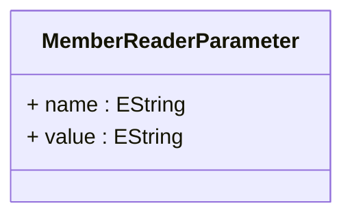

# MemberReaderParameter

Defines configuration parameters that are passed to custom MemberReader implementations to control specialized member loading behavior, caching strategies, performance optimization, and integration with external data sources or business logic systems. MemberReaderParameter represents a flexible configuration mechanism that enables sophisticated customization of how dimensional members are loaded, cached, and presented within OLAP hierarchies, supporting advanced scenarios where standard member loading approaches are insufficient for complex business requirements, performance constraints, or integration needs.

## Extends

## Attributes

<table>
  <thead>
    <tr>
      <th>Name</th>
      <th>Id</th>
      <th>Typ</th>
      <th>Lower</th>
      <th>Upper</th>
    </tr>
  </thead>
  <tbody>
    <tr>
      <td><strong>name</strong></td>
      <td>false</td>
      <td><em>EString</em></td>
      <td>1</td>
      <td>1</td>
    </tr>
    <tr>
      <td colspan="5"><em>Parameter name that identifies the specific configuration setting that this parameter controls within the custom MemberReader implementation. The name serves as the key for parameter lookup and must correspond to parameter names that are recognized and processed by the associated MemberReader class. Common parameter names include cache size settings, connection configuration, security context identifiers, performance tuning options, and business rule specifications that influence member loading behavior. The parameter name enables flexible, extensible configuration where different MemberReader implementations can support different sets of configuration options while maintaining consistent parameter passing mechanisms.</em></td>
    </tr>
    <tr>
      <td><strong>value</strong></td>
      <td>false</td>
      <td><em>EString</em></td>
      <td>1</td>
      <td>1</td>
    </tr>
    <tr>
      <td colspan="5"><em>Parameter value that provides the specific configuration setting or data that the MemberReader implementation will use to customize its behavior. The value format and interpretation depends on the parameter name and the MemberReader implementation, enabling flexible configuration that can include numeric settings, string values, connection strings, file paths, or complex configuration expressions. Common parameter values include cache sizes for memory management, timeout values for external system integration, security tokens for authentication, file paths for configuration resources, and business rule expressions that influence member loading logic. The parameter value enables precise control over MemberReader behavior while maintaining type flexibility that can accommodate diverse configuration requirements across different implementation scenarios.</em></td>
    </tr>
  </tbody>
</table>

## References

<table>
  <thead>
    <tr>
      <th>Name</th>
      <th>Typ</th>
      <th>Lower</th>
      <th>Upper</th>
      <th>Containment</th>
    </tr>
  </thead>
  <tbody>
  </tbody>
</table>

## Used by

- Hierarchy[🔗](./class-Hierarchy) → memberReaderParameters

## ClassDiagramm

