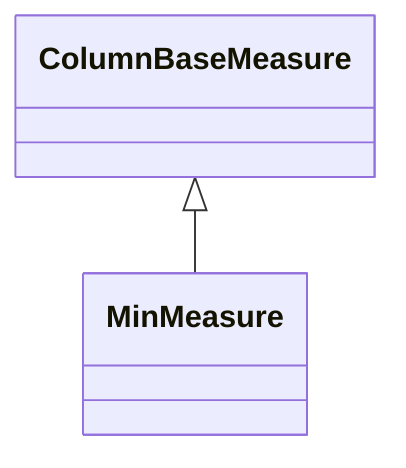

# MinMeasure

A measure that calculates the minimum value from the referenced column across the aggregated data set. MinMeasure uses the SQL MIN() aggregate function to find the smallest value in the grouped data, making it ideal for metrics like lowest price, earliest date, minimum temperature, or smallest quantity. The measure provides non-additive aggregation behavior, meaning the minimum of a set of minimums is simply the overall minimum value. This measure type supports fast database-optimized aggregation and is commonly used for trend analysis, quality control, and boundary condition monitoring.
## Extends
- ColumnBaseMeasure [🔗](./class-ColumnBaseMeasure)
## Attributes

<table>
  <thead>
    <tr>
      <th>Name</th>
      <th>Id</th>
      <th>Typ</th>
      <th>Lower</th>
      <th>Upper</th>
    </tr>
  </thead>
  <tbody>
  </tbody>
</table>

## References

<table>
  <thead>
    <tr>
      <th>Name</th>
      <th>Typ</th>
      <th>Lower</th>
      <th>Upper</th>
      <th>Containment</th>
    </tr>
  </thead>
  <tbody>
  </tbody>
</table>

## Used by

## ClassDiagramm

