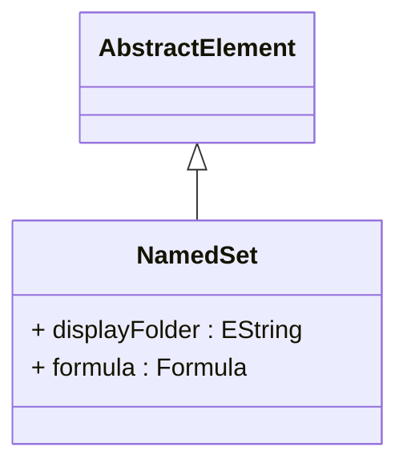

# NamedSet

Defines a reusable collection of dimensional members that can be referenced by name in MDX queries, calculated members, and other analytical expressions, providing powerful capabilities for creating sophisticated analytical logic that operates on predefined sets of business entities. NamedSet represents a fundamental building block for advanced OLAP applications where complex business concepts need to be encapsulated into reusable analytical components that can be consistently applied across multiple queries, reports, and calculations.

## Extends
- AbstractElement [🔗](./class-AbstractElement)
## Attributes

<table>
  <thead>
    <tr>
      <th>Name</th>
      <th>Id</th>
      <th>Typ</th>
      <th>Lower</th>
      <th>Upper</th>
    </tr>
  </thead>
  <tbody>
    <tr>
      <td><strong>displayFolder</strong></td>
      <td>false</td>
      <td><em>EString</em></td>
      <td>0</td>
      <td>1</td>
    </tr>
    <tr>
      <td colspan="5"><em>Organizational folder path that determines how this named set is categorized and presented within client tool metadata browsers, enabling logical grouping of related sets for improved user navigation and analytical organization. Display folders support hierarchical organization using forward-slash notation, allowing complex taxonomies that reflect business organization, analytical domains, or functional categories. This organizational capability is essential for large-scale OLAP deployments where numerous named sets need to be logically organized for efficient discovery and use by analytical users, business analysts, and report developers who need to quickly locate and understand available analytical building blocks.</em></td>
    </tr>
    <tr>
      <td><strong>formula</strong></td>
      <td>false</td>
      <td><em>Formula</em></td>
      <td>0</td>
      <td>1</td>
    </tr>
    <tr>
      <td colspan="5"><em>MDX expression that defines the logic for selecting members that belong to this named set, supporting sophisticated member selection criteria that can include filtering conditions, hierarchical relationships, attribute-based selection, cross-dimensional logic, and dynamic evaluation based on current data values. The formula provides the computational foundation for the named set, enabling complex business rules to be encapsulated in reusable analytical components that can range from simple member enumerations to sophisticated conditional logic that adapts to changing business conditions. Formula expressions support the full range of MDX capabilities including set operations, filtering functions, hierarchical navigation, attribute-based selection, and dynamic evaluation that enables named sets to serve as powerful analytical building blocks for advanced business intelligence applications.</em></td>
    </tr>
  </tbody>
</table>

## References

<table>
  <thead>
    <tr>
      <th>Name</th>
      <th>Typ</th>
      <th>Lower</th>
      <th>Upper</th>
      <th>Containment</th>
    </tr>
  </thead>
  <tbody>
  </tbody>
</table>

## Used by

- Catalog[🔗](./class-Catalog) → namedSets
- Cube[🔗](./class-Cube) → namedSets

## ClassDiagramm

