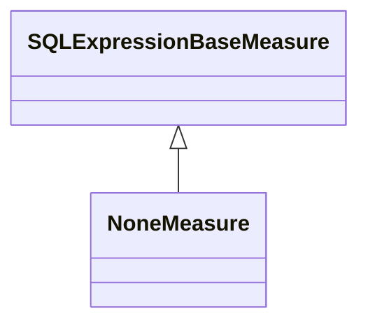

# NoneMeasure

A measure that performs no aggregation and returns raw values from the data source without any mathematical operation. NoneMeasure is used when you need to display individual data values rather than aggregated summaries, such as showing transaction details, individual records, or when drill-through functionality needs to display the exact source data. This measure type is particularly useful for detailed reporting scenarios where aggregation would obscure important individual data points or when the data itself represents already-aggregated values that should not be further processed.
## Extends
- SQLExpressionBaseMeasure [🔗](./class-SQLExpressionBaseMeasure)
## Attributes

<table>
  <thead>
    <tr>
      <th>Name</th>
      <th>Id</th>
      <th>Typ</th>
      <th>Lower</th>
      <th>Upper</th>
    </tr>
  </thead>
  <tbody>
  </tbody>
</table>

## References

<table>
  <thead>
    <tr>
      <th>Name</th>
      <th>Typ</th>
      <th>Lower</th>
      <th>Upper</th>
      <th>Containment</th>
    </tr>
  </thead>
  <tbody>
  </tbody>
</table>

## Used by

## ClassDiagramm

