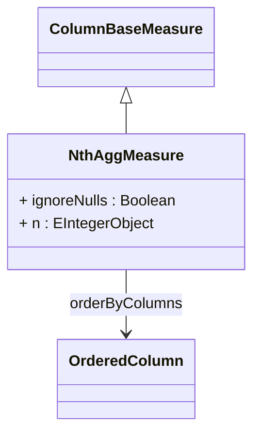

# NthAggMeasure

An advanced measure that returns the Nth value from an ordered set of values in the referenced column across the aggregated data set. NthAggMeasure is useful for retrieving specific positioned values such as the first occurrence, second highest value, last entry, or any specific rank within ordered data. The measure supports custom ordering criteria and null value handling, making it ideal for ranking analysis, top/bottom value identification, and position-specific data retrieval in business intelligence scenarios.
## Extends
- ColumnBaseMeasure [🔗](./class-ColumnBaseMeasure)
## Attributes

<table>
  <thead>
    <tr>
      <th>Name</th>
      <th>Id</th>
      <th>Typ</th>
      <th>Lower</th>
      <th>Upper</th>
    </tr>
  </thead>
  <tbody>
    <tr>
      <td><strong>ignoreNulls</strong></td>
      <td>false</td>
      <td><em>Boolean</em></td>
      <td>0</td>
      <td>1</td>
    </tr>
    <tr>
      <td colspan="5"><em>Boolean flag that controls whether null values are excluded from the position counting when determining the Nth value. When set to true (default), null values are ignored and do not count toward the position N, ensuring that the result always refers to the Nth non-null value. When false, null values are included in the position counting, which may result in null being returned if it occupies the Nth position.</em></td>
    </tr>
    <tr>
      <td><strong>n</strong></td>
      <td>false</td>
      <td><em>EIntegerObject</em></td>
      <td>0</td>
      <td>1</td>
    </tr>
    <tr>
      <td colspan="5"><em>Integer value (1-based) that specifies which position in the ordered set to retrieve. For example, N=1 returns the first value, N=2 returns the second value, and so on. The value must be positive and should not exceed the expected number of values in the aggregated data set. If N is larger than the available values, the measure typically returns null or the last available value depending on the database implementation.</em></td>
    </tr>
  </tbody>
</table>

## References

<table>
  <thead>
    <tr>
      <th>Name</th>
      <th>Typ</th>
      <th>Lower</th>
      <th>Upper</th>
      <th>Containment</th>
    </tr>
  </thead>
  <tbody>
    <tr>
      <td><strong>orderByColumns</strong></td>
      <td>OrderedColumn<a href="./class-OrderedColumn">🔗</a></td>
      <td>1</td>
      <td>&infin;</td>
      <td>false</td>
    </tr>
    <tr>
      <td colspan="5"><em>Collection of ordered columns that define the sorting criteria for determining the Nth value position. The ordering determines how values are ranked and which value corresponds to the specified position N. Multiple columns can be used for complex sorting scenarios, such as ordering by date first, then by amount. At least one OrderedColumn must be specified to ensure consistent and predictable Nth value selection.</em></td>
    </tr>
  </tbody>
</table>

## Used by

## ClassDiagramm

