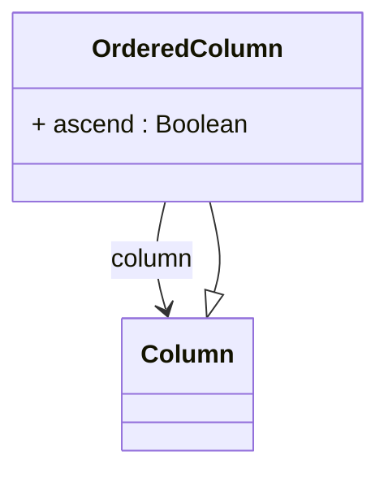

# OrderedColumn

Represents a column with specific ordering information used in queries and result sets. OrderedColumn is typically used in OLAP contexts where explicit column ordering is required for query processing or result presentation.
## Extends
- Column [🔗](./class-Column)
## Attributes

<table>
  <thead>
    <tr>
      <th>Name</th>
      <th>Id</th>
      <th>Typ</th>
      <th>Lower</th>
      <th>Upper</th>
    </tr>
  </thead>
  <tbody>
    <tr>
      <td><strong>ascend</strong></td>
      <td>false</td>
      <td><em>Boolean</em></td>
      <td>0</td>
      <td>1</td>
    </tr>
    <tr>
      <td colspan="5"><em>Boolean flag indicating sort direction. When true, sort in ascending order; when false, sort in descending order. Defaults to true for ascending sort.</em></td>
    </tr>
  </tbody>
</table>

## References

<table>
  <thead>
    <tr>
      <th>Name</th>
      <th>Typ</th>
      <th>Lower</th>
      <th>Upper</th>
      <th>Containment</th>
    </tr>
  </thead>
  <tbody>
    <tr>
      <td><strong>column</strong></td>
      <td>Column<a href="./class-Column">🔗</a></td>
      <td>1</td>
      <td>1</td>
      <td>false</td>
    </tr>
    <tr>
      <td colspan="5"><em>Required reference to the column that provides the ordering basis. This column's values determine the sort order for query results and dimensional member presentation.</em></td>
    </tr>
  </tbody>
</table>

## Used by

- TextAggMeasure[🔗](./class-TextAggMeasure) → orderByColumns
- PercentileMeasure[🔗](./class-PercentileMeasure) → column
- NthAggMeasure[🔗](./class-NthAggMeasure) → orderByColumns

## ClassDiagramm

