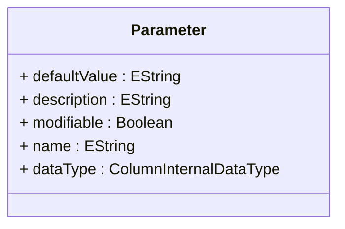

# Parameter

Defines a parameterized input mechanism that enables dynamic, user-driven customization of analytical queries, calculated members, and other OLAP expressions, providing sophisticated capabilities for creating flexible, interactive analytical applications that can adapt to user preferences and changing business requirements. Parameter represents a fundamental component of modern self-service business intelligence, enabling analytical models to be parameterized in ways that allow end users to customize their analytical experience without requiring technical knowledge of MDX or database structures. This parameterization capability supports advanced analytical scenarios including user-driven filtering where business users can specify date ranges, product categories, geographic regions, or other selection criteria through intuitive interfaces, comparative analysis where users can select different time periods, organizational units, or performance metrics for side-by-side comparison, what-if analysis where users can modify assumptions, targets, or business variables to explore different scenarios and their analytical implications, and personalized reporting where individual users can customize standard reports to reflect their specific responsibilities, territories, or analytical interests. Parameters integrate seamlessly with client tools to provide rich user interface capabilities including dropdown lists populated from dimension members, date pickers for temporal parameters, numeric input controls for threshold values, and multi-select interfaces for complex parameter combinations. The parameter framework supports sophisticated validation logic to ensure parameter values are appropriate and meaningful, enables cascading parameters where the available options for one parameter depend on the selection of another, and provides default value mechanisms that ensure analytical applications function correctly even when users do not explicitly specify parameter values.
## Extends

## Attributes

<table>
  <thead>
    <tr>
      <th>Name</th>
      <th>Id</th>
      <th>Typ</th>
      <th>Lower</th>
      <th>Upper</th>
    </tr>
  </thead>
  <tbody>
    <tr>
      <td><strong>defaultValue</strong></td>
      <td>false</td>
      <td><em>EString</em></td>
      <td>0</td>
      <td>1</td>
    </tr>
    <tr>
      <td colspan="5"><em>Default parameter value that is automatically applied when users do not explicitly specify a parameter value, ensuring that parameterized analytical applications function correctly and provide meaningful results even when parameters are not explicitly set by end users. The default value mechanism is essential for robust analytical applications where parameter-driven calculations must produce sensible results under all usage conditions, supporting scenarios such as date range parameters that default to current month or year when users do not specify custom periods, geographic parameters that default to the user's home region or organizational territory, product category parameters that default to comprehensive product sets or user-specific product responsibilities, and performance threshold parameters that default to standard business targets or industry benchmarks. Default values enable sophisticated user experience patterns including progressive disclosure where basic users can rely on sensible defaults while advanced users can override with custom values, onboarding scenarios where new users can immediately access functional analytical applications without needing to understand complex parameter configurations, and automated report generation where scheduled reports can execute successfully without user intervention while still providing customization capabilities when needed. The default value system supports dynamic default generation where default values can be calculated based on user context, current date, organizational affiliation, or other environmental factors, enabling intelligent parameter behavior that adapts to different usage contexts while maintaining consistent analytical functionality across diverse user scenarios and business requirements.</em></td>
    </tr>
    <tr>
      <td><strong>description</strong></td>
      <td>false</td>
      <td><em>EString</em></td>
      <td>0</td>
      <td>1</td>
    </tr>
    <tr>
      <td colspan="5"><em>Detailed explanatory text that describes the parameter's purpose, expected values, impact on analytical results, and usage guidelines, providing essential user guidance that enables effective parameter utilization in self-service analytical applications. The description serves as critical documentation that bridges the gap between technical parameter implementation and business user understanding, supporting sophisticated analytical applications where parameter complexity might otherwise create barriers to effective usage. This descriptive capability is particularly valuable for complex parameters that affect multiple aspects of analytical calculation, parameters that interact with other parameters in non-obvious ways, parameters that require domain-specific knowledge for effective usage, and parameters that have significant performance or functionality implications based on their values. Parameter descriptions support advanced user assistance scenarios including contextual help systems where parameter guidance is integrated directly into analytical interfaces, training and documentation programs where parameter usage is explained in business terms rather than technical specifications, parameter validation and error handling where descriptive information helps users understand and correct parameter entry mistakes, and collaborative analytical environments where parameter descriptions enable knowledge sharing and consistent parameter usage across teams and organizational units. The description framework enables rich documentation including parameter value examples, business impact explanations, interaction effects with other parameters, and best practice guidance that empowers business users to leverage parameterized analytical capabilities effectively while maintaining analytical accuracy and performance optimization.</em></td>
    </tr>
    <tr>
      <td><strong>modifiable</strong></td>
      <td>false</td>
      <td><em>Boolean</em></td>
      <td>0</td>
      <td>1</td>
    </tr>
    <tr>
      <td colspan="5"><em>Boolean flag controlling whether end users can modify this parameter's value through client interfaces, enabling sophisticated parameter governance scenarios where certain parameters can be locked to maintain analytical consistency, security, or compliance requirements while still allowing user customization of other parameters. The modifiable setting provides essential parameter management capabilities where administrators can control which aspects of analytical applications users can customize, supporting scenarios such as security-sensitive parameters that must remain fixed to prevent unauthorized data access, performance-critical parameters that must be set by administrators to ensure optimal system operation, compliance-required parameters that must conform to regulatory standards and cannot be modified by end users, and business rule parameters that must remain consistent across organizational units to ensure comparable analytical results. This governance capability enables sophisticated parameter architecture including read-only parameters that provide transparency into analytical logic without allowing modification, administrative parameters that can only be changed by authorized system administrators, role-based parameter access where different user types have different levels of parameter control, and hybrid parameter systems where some aspects are user-modifiable while others remain under administrative control. The modifiable flag supports comprehensive parameter security models including audit trails for parameter changes, approval workflows for parameter modifications, and parameter inheritance patterns where modifiability can be controlled at different levels of organizational hierarchy while maintaining analytical flexibility and user empowerment within appropriate governance boundaries.</em></td>
    </tr>
    <tr>
      <td><strong>name</strong></td>
      <td>false</td>
      <td><em>EString</em></td>
      <td>1</td>
      <td>1</td>
    </tr>
    <tr>
      <td colspan="5"><em>Unique identifier for this parameter that serves as both the technical reference used in MDX expressions and calculated members, and the basis for user-facing parameter labels in client applications and analytical interfaces. The parameter name establishes the fundamental identity that connects parameter definition with parameter usage throughout the analytical application, enabling sophisticated parameterized calculations where MDX expressions can reference parameter values using consistent, meaningful identifiers that reflect business concepts rather than technical implementation details. This naming capability is essential for maintaining clear relationships between parameter definitions and their usage across complex analytical models where multiple parameters may interact in sophisticated ways, supporting scenarios such as cascading parameter relationships where parameter names enable clear dependency tracking, parameter validation logic where parameter names support readable business rule expressions, parameter documentation and training where meaningful names facilitate user understanding and adoption, and parameter maintenance where descriptive names enable efficient administrative management of complex parameter sets. The parameter name serves as the foundation for sophisticated parameter management including parameter libraries where reusable parameter definitions can be shared across analytical applications, parameter templates where standard parameter patterns can be applied to multiple analytical contexts, and parameter integration scenarios where external systems can reference analytical parameters using stable, meaningful identifiers that support long-term integration architectures while maintaining analytical flexibility and parameter evolution capabilities across enterprise business intelligence environments.</em></td>
    </tr>
    <tr>
      <td><strong>dataType</strong></td>
      <td>false</td>
      <td><em>ColumnInternalDataType<a href="./enum-ColumnInternalDataType">🔗</a></em></td>
      <td>1</td>
      <td>1</td>
    </tr>
    <tr>
      <td colspan="5"><em>Data type specification that defines the expected format and validation requirements for parameter values, ensuring type safety, input validation, and appropriate client interface generation for parameter entry and manipulation. The data type establishes the fundamental parameter characteristics that determine how parameter values are processed, validated, and integrated into analytical calculations, supporting sophisticated parameter systems where type-specific behavior enables optimal user experiences and analytical accuracy. This type specification is essential for robust parameter implementations where different data types require different input validation, formatting, and processing logic, supporting scenarios such as date parameters that require temporal validation and calendar interfaces, numeric parameters that need range validation and numeric input controls, string parameters that may require pattern matching or enumerated value selection, and boolean parameters that translate to checkbox or toggle interfaces in client applications. The data type specification enables advanced parameter capabilities including type-specific validation logic that prevents invalid parameter values from corrupting analytical calculations, automatic client interface generation where parameter entry forms are automatically configured based on data type requirements, type conversion and formatting logic that ensures parameter values are appropriately processed for integration into MDX expressions and analytical calculations, and parameter interoperability scenarios where parameter values can be safely exchanged between different analytical applications and systems while maintaining type safety and data integrity. Enterprise implementations leverage data type specifications for comprehensive parameter architecture including type inheritance where specialized parameter types can extend base type behavior, type-specific security policies where different data types may have different access control requirements, and parameter federation scenarios where type information enables safe parameter sharing across distributed analytical environments while maintaining robust parameter validation and processing capabilities.</em></td>
    </tr>
  </tbody>
</table>

## References

<table>
  <thead>
    <tr>
      <th>Name</th>
      <th>Typ</th>
      <th>Lower</th>
      <th>Upper</th>
      <th>Containment</th>
    </tr>
  </thead>
  <tbody>
  </tbody>
</table>

## Used by

- Catalog[🔗](./class-Catalog) → parameters

## ClassDiagramm

