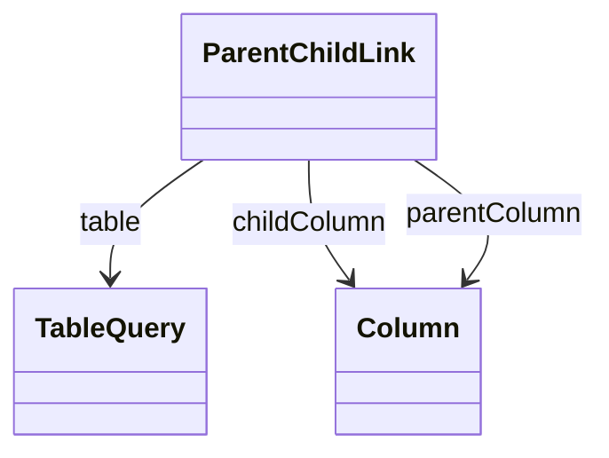

# ParentChildLink

Defines closure table configuration for parent-child hierarchies that dramatically improves query performance by pre-computing and storing all ancestor-descendant relationships in a separate table structure, enabling efficient recursive queries and aggregations without requiring complex recursive SQL operations. ParentChildLink represents a sophisticated performance optimization technique for parent-child hierarchies that can contain thousands or millions of members with complex, variable-depth relationships that would otherwise require expensive recursive database operations for navigation and aggregation. This closure table approach is essential for large-scale parent-child hierarchies including organizational structures with deep reporting relationships, account hierarchies with complex sub-account nesting, product categorization systems with variable taxonomic depth, and geographic hierarchies with irregular administrative divisions. The closure table maintains explicit records for every ancestor-descendant relationship in the hierarchy, enabling the OLAP engine to perform complex hierarchical operations using simple join operations rather than recursive queries, which provides dramatic performance improvements for hierarchical navigation, member filtering, aggregation rollup, and security evaluation. ParentChildLink supports sophisticated closure table scenarios including incremental closure table maintenance where only changed relationships are updated, hybrid approaches where closure tables are used for performance-critical operations while maintaining live parent-child relationships for flexibility, and partitioned closure tables that can scale to support extremely large hierarchical structures across multiple database partitions or tables.
## Extends

## Attributes

<table>
  <thead>
    <tr>
      <th>Name</th>
      <th>Id</th>
      <th>Typ</th>
      <th>Lower</th>
      <th>Upper</th>
    </tr>
  </thead>
  <tbody>
  </tbody>
</table>

## References

<table>
  <thead>
    <tr>
      <th>Name</th>
      <th>Typ</th>
      <th>Lower</th>
      <th>Upper</th>
      <th>Containment</th>
    </tr>
  </thead>
  <tbody>
    <tr>
      <td><strong>table</strong></td>
      <td>TableQuery<a href="./class-TableQuery">🔗</a></td>
      <td>1</td>
      <td>1</td>
      <td>true</td>
    </tr>
    <tr>
      <td colspan="5"><em>Reference to the TableQuery that defines the closure table structure used to store pre-computed ancestor-descendant relationships for this parent-child hierarchy, establishing the physical database table that contains the materialized hierarchical relationships necessary for efficient parent-child operations. The closure table represents a critical performance optimization strategy where all possible ancestor-descendant pairs are pre-calculated and stored in a dedicated table structure, enabling complex hierarchical queries and aggregations to be executed using simple SQL joins rather than expensive recursive operations. This table specification is essential for large-scale parent-child hierarchies where runtime recursive processing would create unacceptable performance bottlenecks, supporting scenarios such as deep organizational hierarchies with hundreds of management levels, complex account structures with intricate sub-account relationships, product taxonomies with variable categorization depths, and geographic hierarchies with irregular administrative subdivisions. The closure table approach transforms hierarchical navigation from recursive SQL operations into standard relational joins, providing dramatic performance improvements for operations including member ancestor and descendant lookups, hierarchical aggregation rollups, level-based filtering and security evaluation, and cross-hierarchical correlation analysis. Enterprise implementations leverage closure tables for sophisticated hierarchical management including incremental maintenance strategies where only changed relationships are recalculated, hybrid architectures where closure tables coexist with live parent-child relationships for different use cases, and distributed closure table scenarios where hierarchical relationships can be partitioned across multiple database systems while maintaining unified query performance and analytical consistency across complex multidimensional business intelligence environments.</em></td>
    </tr>
    <tr>
      <td><strong>childColumn</strong></td>
      <td>Column<a href="./class-Column">🔗</a></td>
      <td>1</td>
      <td>1</td>
      <td>false</td>
    </tr>
    <tr>
      <td colspan="5"><em>Reference to the database column in the closure table that stores the child member identifier in each ancestor-descendant relationship record, representing the descendant side of the hierarchical relationship and enabling efficient identification of all members that are children, grandchildren, or deeper descendants of any given parent member. The child column serves as a critical component of the closure table structure that enables rapid hierarchical navigation and aggregation operations without requiring recursive SQL processing, providing the foundation for sophisticated parent-child analytical capabilities including descendant member enumeration, hierarchical filtering operations, and rollup aggregation calculations. This column specification is essential for closure table implementations where descendant identification must be optimized for query performance across large hierarchical datasets, supporting scenarios such as organizational reporting where managers need to access all subordinate employees regardless of hierarchical depth, financial consolidation where parent accounts must aggregate all subsidiary account values, product analysis where category performance includes all sub-category and product-level metrics, and geographic analysis where regional aggregations encompass all contained administrative divisions. The child column enables advanced hierarchical query patterns including descendant-based security filtering where access controls propagate down hierarchical structures, level-based analysis where aggregations can be performed at different hierarchical depths, and cross-dimensional correlation where parent-child relationships support analytical operations across multiple business perspectives while maintaining optimal query performance and data consistency across enterprise-scale multidimensional analytical environments.</em></td>
    </tr>
    <tr>
      <td><strong>parentColumn</strong></td>
      <td>Column<a href="./class-Column">🔗</a></td>
      <td>1</td>
      <td>1</td>
      <td>false</td>
    </tr>
    <tr>
      <td colspan="5"><em>Reference to the database column in the closure table that stores the parent member identifier in each ancestor-descendant relationship record, representing the ancestor side of the hierarchical relationship and enabling efficient identification of all members that are parents, grandparents, or higher-level ancestors of any given child member. The parent column complements the child column to create complete ancestor-descendant relationship records that eliminate the need for recursive SQL operations during hierarchical navigation and aggregation processes, providing the foundation for high-performance parent-child analytical operations across complex organizational and taxonomic structures. This column specification is crucial for closure table architectures where ancestor identification and rollup operations must be optimized for enterprise-scale hierarchical analysis, supporting scenarios such as organizational cost rollups where expenses are aggregated from individual employees through all management levels to executive reporting, account consolidation where detailed transaction data is summarized through multiple account hierarchy levels, product profitability analysis where individual SKU performance is consolidated through product lines, categories, and divisions, and geographic revenue analysis where location-specific results are aggregated through territories, regions, and corporate levels. The parent column enables sophisticated hierarchical analytical patterns including ancestor-based security inheritance where permissions are propagated up hierarchical structures, level-skipping aggregations where calculations can bypass intermediate levels for performance optimization, and multi-path hierarchy support where members can have multiple parent relationships while maintaining analytical consistency and query performance across complex business intelligence scenarios that require flexible, scalable hierarchical data management and analysis capabilities.</em></td>
    </tr>
  </tbody>
</table>

## Used by

- ParentChildHierarchy[🔗](./class-ParentChildHierarchy) → parentChildLink

## ClassDiagramm

