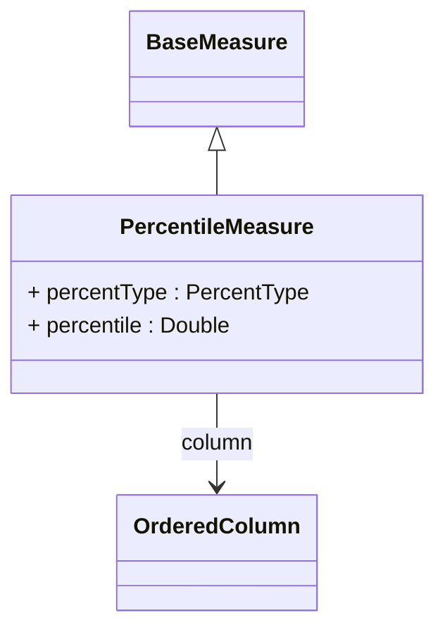

# PercentileMeasure

An advanced statistical measure that calculates percentile values from the referenced column across the aggregated data set. PercentileMeasure uses SQL percentile functions (PERCENTILE_DISC or PERCENTILE_CONT) to determine values at specific percentage points in the data distribution. This measure is essential for statistical analysis, distribution studies, quartile calculations, and performance benchmarking. Common use cases include median calculations (50th percentile), quartile analysis (25th, 75th percentiles), or identifying values at specific distribution points for outlier detection and performance analysis.
## Extends
- BaseMeasure [🔗](./class-BaseMeasure)
## Attributes

<table>
  <thead>
    <tr>
      <th>Name</th>
      <th>Id</th>
      <th>Typ</th>
      <th>Lower</th>
      <th>Upper</th>
    </tr>
  </thead>
  <tbody>
    <tr>
      <td><strong>percentType</strong></td>
      <td>false</td>
      <td><em>PercentType<a href="./enum-PercentType">🔗</a></em></td>
      <td>0</td>
      <td>1</td>
    </tr>
    <tr>
      <td colspan="5"><em>Specifies the type of percentile calculation to perform. 'DISC' (discrete) returns an actual value from the dataset that corresponds to the percentile position, while 'CONT' (continuous) may interpolate between values to provide a more precise percentile result. The choice affects the precision and interpretation of percentile results, with discrete being more appropriate for categorical data and continuous for numerical analysis.</em></td>
    </tr>
    <tr>
      <td><strong>percentile</strong></td>
      <td>false</td>
      <td><em>Double</em></td>
      <td>0</td>
      <td>1</td>
    </tr>
    <tr>
      <td colspan="5"><em>Double value between 0.0 and 1.0 that specifies which percentile to calculate. Common values include 0.25 (25th percentile/first quartile), 0.5 (50th percentile/median), 0.75 (75th percentile/third quartile), 0.9 (90th percentile), and 0.95 (95th percentile). The default value of 1.0 represents the maximum value (100th percentile). This value determines the specific point in the data distribution that the measure will return.</em></td>
    </tr>
  </tbody>
</table>

## References

<table>
  <thead>
    <tr>
      <th>Name</th>
      <th>Typ</th>
      <th>Lower</th>
      <th>Upper</th>
      <th>Containment</th>
    </tr>
  </thead>
  <tbody>
    <tr>
      <td><strong>column</strong></td>
      <td>OrderedColumn<a href="./class-OrderedColumn">🔗</a></td>
      <td>1</td>
      <td>1</td>
      <td>false</td>
    </tr>
    <tr>
      <td colspan="5"><em>Reference to the OrderedColumn that defines both the source data values and the sorting criteria for percentile calculation. The OrderedColumn specifies the column containing the values to analyze and the sort order (ascending or descending) that determines how percentiles are computed. This is essential for accurate percentile calculations as the ordering directly affects which values correspond to specific percentile positions.</em></td>
    </tr>
  </tbody>
</table>

## Used by

## ClassDiagramm

