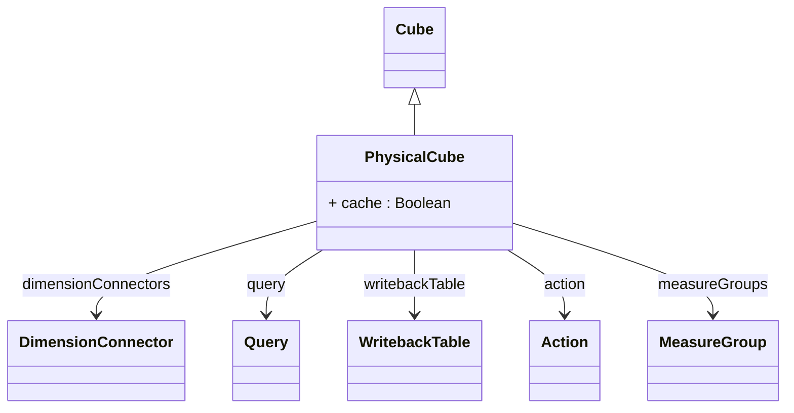

# PhysicalCube

A concrete cube implementation that maps directly to one or more fact tables in the underlying database. PhysicalCube represents the most common type of OLAP cube, where measures are derived from numeric columns in fact tables and dimensions provide different analytical perspectives on that factual data. Each PhysicalCube is built around a central fact table (or fact view) that contains the quantitative data to be analyzed, connected to dimension tables through foreign key relationships. The PhysicalCube handles the mapping between the logical OLAP model and the physical relational database structure, enabling the OLAP engine to generate efficient SQL queries for analysis operations.
## Extends
- Cube [🔗](./class-Cube)
## Attributes

<table>
  <thead>
    <tr>
      <th>Name</th>
      <th>Id</th>
      <th>Typ</th>
      <th>Lower</th>
      <th>Upper</th>
    </tr>
  </thead>
  <tbody>
    <tr>
      <td><strong>cache</strong></td>
      <td>false</td>
      <td><em>Boolean</em></td>
      <td>0</td>
      <td>1</td>
    </tr>
    <tr>
      <td colspan="5"><em>Boolean flag that controls whether query results and calculated values for this cube should be cached by the OLAP engine. When enabled (default), the system caches query results, aggregated values, and member data to improve performance for subsequent queries. Disabling cache may be useful for cubes with rapidly changing data or during development and testing phases where fresh data is always required.</em></td>
    </tr>
  </tbody>
</table>

## References

<table>
  <thead>
    <tr>
      <th>Name</th>
      <th>Typ</th>
      <th>Lower</th>
      <th>Upper</th>
      <th>Containment</th>
    </tr>
  </thead>
  <tbody>
    <tr>
      <td><strong>dimensionConnectors</strong></td>
      <td>DimensionConnector<a href="./class-DimensionConnector">🔗</a></td>
      <td>0</td>
      <td>&infin;</td>
      <td>true</td>
    </tr>
    <tr>
      <td colspan="5"><em>Collection of dimension connectors that link this physical cube to its analytical dimensions. Each DimensionConnector defines how a dimension relates to the cube's fact table, specifying the foreign key columns that connect facts to dimension members. These connectors enable the cube to be sliced and diced along different analytical axes, such as time, geography, product categories, or customer segments. The connectors handle both shared dimensions (used across multiple cubes) and cube-specific dimensions.</em></td>
    </tr>
    <tr>
      <td><strong>query</strong></td>
      <td>Query<a href="./class-Query">🔗</a></td>
      <td>1</td>
      <td>1</td>
      <td>false</td>
    </tr>
    <tr>
      <td colspan="5"><em>Reference to the Query object that defines how to retrieve the fact data for this cube. This is typically a TableQuery pointing to a fact table, but can also be a more complex JoinQuery for snowflake schemas or a SqlSelectQuery for custom fact views. The query defines the primary data source for all measures in this cube and serves as the foundation for SQL generation during OLAP operations. This is a required field as every physical cube must have a data source.</em></td>
    </tr>
    <tr>
      <td><strong>writebackTable</strong></td>
      <td>WritebackTable<a href="./class-WritebackTable">🔗</a></td>
      <td>0</td>
      <td>1</td>
      <td>true</td>
    </tr>
    <tr>
      <td colspan="5"><em>Optional configuration for writeback functionality, which allows users to modify cube data through OLAP clients and have those changes written back to the database. The WritebackTable defines the target table structure, column mappings, and rules for how user modifications should be translated into database updates. This enables planning and budgeting scenarios where users can input forecast data or adjust targets directly through pivot tables and analytical tools.</em></td>
    </tr>
    <tr>
      <td><strong>action</strong></td>
      <td>Action<a href="./class-Action">🔗</a></td>
      <td>0</td>
      <td>&infin;</td>
      <td>true</td>
    </tr>
    <tr>
      <td colspan="5"><em>Collection of actions that define interactive operations available to users when analyzing this cube. Actions provide integration points with external systems and enable drill-through to detailed data, launching reports, opening web pages, or executing custom business logic. Common actions include drill-through to transaction details, launching related applications, or triggering business processes based on the analytical context of the user's current selection.</em></td>
    </tr>
    <tr>
      <td><strong>measureGroups</strong></td>
      <td>MeasureGroup<a href="./class-MeasureGroup">🔗</a></td>
      <td>1</td>
      <td>&infin;</td>
      <td>true</td>
    </tr>
    <tr>
      <td colspan="5"><em>Collection of measure groups that organize the measures (metrics) available in this cube. Each MeasureGroup represents a logical grouping of related measures that share common properties like data source, aggregation behavior, or business domain. For example, a sales cube might have separate measure groups for 'Sales Metrics' (revenue, quantity) and 'Cost Metrics' (cost of goods, expenses). At least one measure group is required as every physical cube must provide measures for analysis.</em></td>
    </tr>
  </tbody>
</table>

## Used by

- MeasureGroup[🔗](./class-MeasureGroup) → physicalCube
- DimensionConnector[🔗](./class-DimensionConnector) → physicalCube
- CalculatedMember[🔗](./class-CalculatedMember) → physicalCube

## ClassDiagramm

