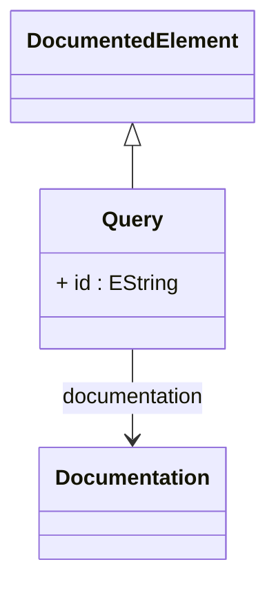

# Query

Abstract base class for all data source queries in the OLAP mapping system, providing the foundation for accessing and combining data from various sources including physical database tables, custom SQL views, in-memory data sets, and complex multi-table joins. Queries serve as the data access layer that bridges the logical OLAP model with physical data storage, enabling the OLAP engine to generate appropriate SQL statements for different database systems while maintaining abstraction from specific storage implementations. The Query hierarchy supports composable patterns where simple queries can be combined into complex data access structures through joins, enabling sophisticated dimensional modeling over normalized database schemas and custom data integration scenarios.
## Extends
- DocumentedElement [🔗](./class-DocumentedElement)
## Attributes

<table>
  <thead>
    <tr>
      <th>Name</th>
      <th>Id</th>
      <th>Typ</th>
      <th>Lower</th>
      <th>Upper</th>
    </tr>
  </thead>
  <tbody>
    <tr>
      <td><strong>id</strong></td>
      <td>true</td>
      <td><em>EString</em></td>
      <td>1</td>
      <td>1</td>
    </tr>
    <tr>
      <td colspan="5"><em>Unique identifier for this query within the catalog scope, used for referencing the query from other OLAP model elements such as cube definitions, hierarchy specifications, and level mappings. The ID enables query reuse across multiple dimensional contexts and supports modular data access design patterns where complex queries can be defined once and referenced multiple times throughout the analytical model.</em></td>
    </tr>
  </tbody>
</table>

## References

<table>
  <thead>
    <tr>
      <th>Name</th>
      <th>Typ</th>
      <th>Lower</th>
      <th>Upper</th>
      <th>Containment</th>
    </tr>
  </thead>
  <tbody>
    <tr>
      <td><strong>documentation</strong></td>
      <td>Documentation<a href="./class-Documentation">🔗</a></td>
      <td>0</td>
      <td>1</td>
      <td>true</td>
    </tr>
    <tr>
      <td colspan="5"><em>Documentation element that provides descriptive information about this SQL expression column. Contains text explaining the purpose and behavior of the SQL expression, helping developers understand complex calculated columns.</em></td>
    </tr>
  </tbody>
</table>

## Used by

- PhysicalCube[🔗](./class-PhysicalCube) → query
- Hierarchy[🔗](./class-Hierarchy) → query
- JoinedQueryElement[🔗](./class-JoinedQueryElement) → query

## ClassDiagramm

