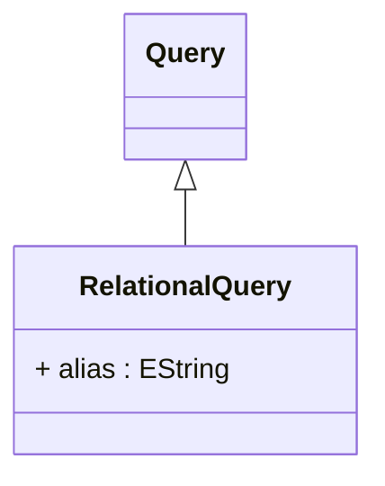

# RelationalQuery

Abstract base class for queries that produce relational result sets suitable for SQL generation and relational database operations. RelationalQuery extends the base Query with SQL aliasing capabilities, enabling proper table and column reference management in generated SQL statements. This class serves as the foundation for concrete query implementations that interact with relational databases, including direct table access, custom SQL views, and in-memory relational data structures. The relational nature enables standard SQL operations like joins, filtering, grouping, and sorting, while maintaining compatibility with OLAP-specific requirements like dimension member loading, hierarchy navigation, and measure aggregation.
## Extends
- Query [🔗](./class-Query)
## Attributes

<table>
  <thead>
    <tr>
      <th>Name</th>
      <th>Id</th>
      <th>Typ</th>
      <th>Lower</th>
      <th>Upper</th>
    </tr>
  </thead>
  <tbody>
    <tr>
      <td><strong>alias</strong></td>
      <td>false</td>
      <td><em>EString</em></td>
      <td>0</td>
      <td>1</td>
    </tr>
    <tr>
      <td colspan="5"><em>Optional SQL table alias for this query when used in joins or complex SQL statements. The alias provides a short, unique identifier that can be referenced in column expressions, WHERE clauses, and join conditions, enabling clear and unambiguous SQL generation especially when the same table appears multiple times in a query or when working with long table names. When not specified, the OLAP engine may generate automatic aliases based on the query ID or table name to ensure SQL correctness.</em></td>
    </tr>
  </tbody>
</table>

## References

<table>
  <thead>
    <tr>
      <th>Name</th>
      <th>Typ</th>
      <th>Lower</th>
      <th>Upper</th>
      <th>Containment</th>
    </tr>
  </thead>
  <tbody>
  </tbody>
</table>

## Used by

## ClassDiagramm

