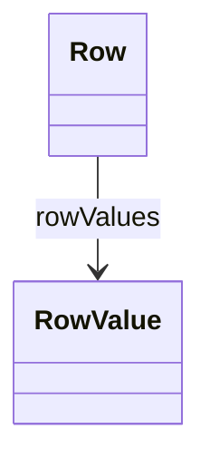

# Row

Represents a single data row within an InlineTable, containing a collection of column values. Row provides the structure for embedding tabular data directly in the OLAP schema definition.
## Extends

## Attributes

<table>
  <thead>
    <tr>
      <th>Name</th>
      <th>Id</th>
      <th>Typ</th>
      <th>Lower</th>
      <th>Upper</th>
    </tr>
  </thead>
  <tbody>
  </tbody>
</table>

## References

<table>
  <thead>
    <tr>
      <th>Name</th>
      <th>Typ</th>
      <th>Lower</th>
      <th>Upper</th>
      <th>Containment</th>
    </tr>
  </thead>
  <tbody>
    <tr>
      <td><strong>rowValues</strong></td>
      <td>RowValue<a href="./class-RowValue">🔗</a></td>
      <td>0</td>
      <td>&infin;</td>
      <td>true</td>
    </tr>
    <tr>
      <td colspan="5"><em>Collection of column values for this row. Each RowValue pairs a column reference with its corresponding data value, defining the complete content of this table row.</em></td>
    </tr>
  </tbody>
</table>

## Used by

- InlineTable[🔗](./class-InlineTable) → rows

## ClassDiagramm

