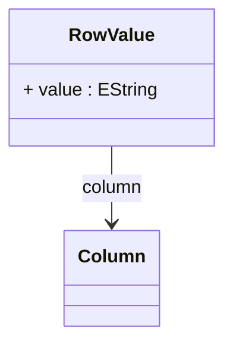

# RowValue

Represents a single column value within a row of an InlineTable. RowValue pairs a column reference with its data value, providing the basic unit for embedding tabular data in OLAP schema definitions.
## Extends

## Attributes

<table>
  <thead>
    <tr>
      <th>Name</th>
      <th>Id</th>
      <th>Typ</th>
      <th>Lower</th>
      <th>Upper</th>
    </tr>
  </thead>
  <tbody>
    <tr>
      <td><strong>value</strong></td>
      <td>false</td>
      <td><em>EString</em></td>
      <td>0</td>
      <td>1</td>
    </tr>
    <tr>
      <td colspan="5"><em>The actual data value for this column in string format. Values are converted to appropriate data types based on the column definition when processed by the OLAP engine.</em></td>
    </tr>
  </tbody>
</table>

## References

<table>
  <thead>
    <tr>
      <th>Name</th>
      <th>Typ</th>
      <th>Lower</th>
      <th>Upper</th>
      <th>Containment</th>
    </tr>
  </thead>
  <tbody>
    <tr>
      <td><strong>column</strong></td>
      <td>Column<a href="./class-Column">🔗</a></td>
      <td>1</td>
      <td>1</td>
      <td>false</td>
    </tr>
    <tr>
      <td colspan="5"><em>Required reference to the column definition that this value corresponds to. The column reference ensures proper data type mapping and structural consistency within the inline table.</em></td>
    </tr>
  </tbody>
</table>

## Used by

- Row[🔗](./class-Row) → rowValues

## ClassDiagramm

