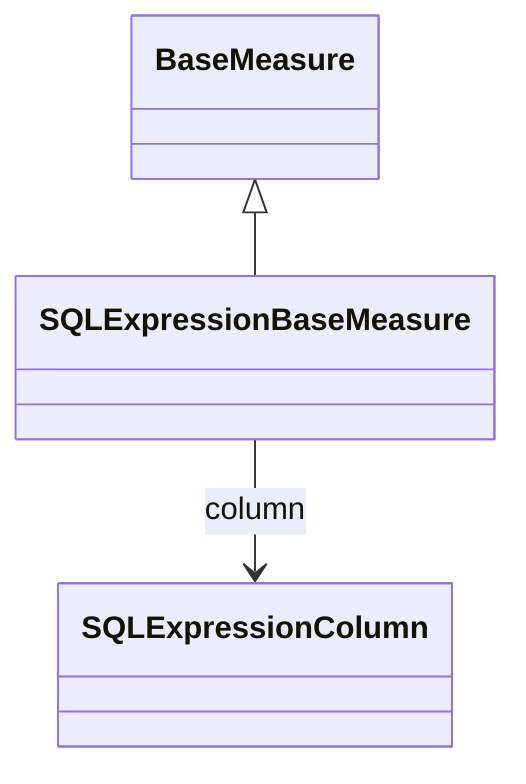

# SQLExpressionBaseMeasure

Advanced measure implementation that enables sophisticated analytical calculations through custom SQL expressions, providing powerful capabilities for implementing complex business logic, mathematical computations, and data transformations that cannot be achieved through standard column-based measures or simple aggregation functions. 

## Extends
- BaseMeasure [🔗](./class-BaseMeasure)
## Attributes

<table>
  <thead>
    <tr>
      <th>Name</th>
      <th>Id</th>
      <th>Typ</th>
      <th>Lower</th>
      <th>Upper</th>
    </tr>
  </thead>
  <tbody>
  </tbody>
</table>

## References

<table>
  <thead>
    <tr>
      <th>Name</th>
      <th>Typ</th>
      <th>Lower</th>
      <th>Upper</th>
      <th>Containment</th>
    </tr>
  </thead>
  <tbody>
    <tr>
      <td><strong>column</strong></td>
      <td>SQLExpressionColumn<a href="./class-SQLExpressionColumn">🔗</a></td>
      <td>1</td>
      <td>1</td>
      <td>false</td>
    </tr>
    <tr>
      <td colspan="5"><em>Reference to the SQLExpressionColumn that defines the custom SQL expression logic for this advanced measure implementation. The SQLExpressionColumn contains the sophisticated SQL formula, mathematical computations, conditional logic, and data transformations that enable complex analytical calculations beyond the capabilities of standard column-based aggregation functions. This relationship establishes the connection between the measure definition and its custom SQL implementation, enabling powerful analytical scenarios such as weighted averages with multiple factors, conditional aggregations based on dimensional context, statistical calculations requiring advanced mathematical functions, financial formulas implementing specific industry regulations, and composite metrics that combine multiple data sources with complex business rules. The referenced SQLExpressionColumn must provide a valid SQL expression that can be evaluated within the aggregation context, supporting database-specific functions and syntax while maintaining optimal query performance through intelligent SQL generation and optimization strategies that preserve both computational accuracy and analytical flexibility across diverse business intelligence requirements.</em></td>
    </tr>
  </tbody>
</table>

## Used by

## ClassDiagramm

