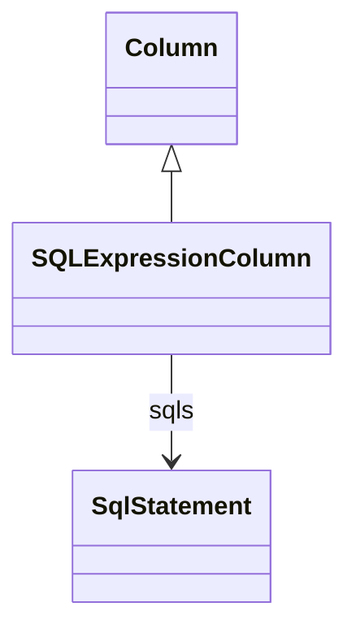

# SQLExpressionColumn

Represents a virtual column defined by SQL expressions rather than physical table columns. SQLExpressionColumn enables computed columns, derived values, and complex calculations in OLAP mappings.
## Extends
- Column [🔗](./class-Column)
## Attributes

<table>
  <thead>
    <tr>
      <th>Name</th>
      <th>Id</th>
      <th>Typ</th>
      <th>Lower</th>
      <th>Upper</th>
    </tr>
  </thead>
  <tbody>
  </tbody>
</table>

## References

<table>
  <thead>
    <tr>
      <th>Name</th>
      <th>Typ</th>
      <th>Lower</th>
      <th>Upper</th>
      <th>Containment</th>
    </tr>
  </thead>
  <tbody>
    <tr>
      <td><strong>sqls</strong></td>
      <td>SqlStatement<a href="./class-SqlStatement">🔗</a></td>
      <td>1</td>
      <td>&infin;</td>
      <td>true</td>
    </tr>
    <tr>
      <td colspan="5"><em>Collection of SQL statements that define the expression for this column. Multiple statements support database-specific SQL expressions for different database dialects.</em></td>
    </tr>
  </tbody>
</table>

## Used by

- SQLExpressionBaseMeasure[🔗](./class-SQLExpressionBaseMeasure) → column

## ClassDiagramm

