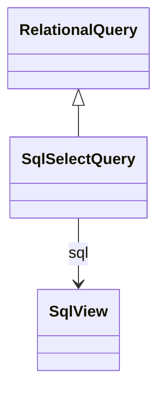

# SqlSelectQuery

Wraps custom SQL SELECT statements as query sources, enabling the integration of complex business logic, database views, stored procedures, and advanced SQL constructs that cannot be expressed through standard table or join queries. SqlSelectQuery provides the flexibility to incorporate sophisticated data transformations, conditional logic, window functions, and database-specific features while maintaining compatibility with the OLAP engine's SQL generation and optimization capabilities. This query type is essential for scenarios requiring custom data preparation, complex calculations, legacy system integration, or advanced analytical functions that extend beyond standard relational operations.
## Extends
- RelationalQuery [🔗](./class-RelationalQuery)
## Attributes

<table>
  <thead>
    <tr>
      <th>Name</th>
      <th>Id</th>
      <th>Typ</th>
      <th>Lower</th>
      <th>Upper</th>
    </tr>
  </thead>
  <tbody>
  </tbody>
</table>

## References

<table>
  <thead>
    <tr>
      <th>Name</th>
      <th>Typ</th>
      <th>Lower</th>
      <th>Upper</th>
      <th>Containment</th>
    </tr>
  </thead>
  <tbody>
    <tr>
      <td><strong>sql</strong></td>
      <td>SqlView<a href="./class-SqlView">🔗</a></td>
      <td>1</td>
      <td>1</td>
      <td>true</td>
    </tr>
    <tr>
      <td colspan="5"><em>Contains the custom SQL SELECT statement definition that provides the data for this query. The SqlView encapsulates the SQL text along with database dialect specifications, enabling the same logical query to have different implementations for different database systems. The SQL statement must produce a result set with consistent column names and data types that can be referenced by other OLAP model elements such as levels, measures, and member properties.</em></td>
    </tr>
  </tbody>
</table>

## Used by

## ClassDiagramm

