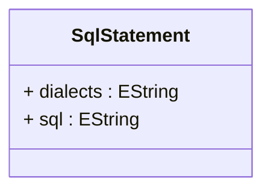

# SqlStatement

Contains SQL expression text and database dialect information for database-specific SQL implementations. SqlStatement enables OLAP schemas to support multiple database platforms by providing dialect-specific SQL expressions.
## Extends

## Attributes

<table>
  <thead>
    <tr>
      <th>Name</th>
      <th>Id</th>
      <th>Typ</th>
      <th>Lower</th>
      <th>Upper</th>
    </tr>
  </thead>
  <tbody>
    <tr>
      <td><strong>dialects</strong></td>
      <td>false</td>
      <td><em>EString</em></td>
      <td>0</td>
      <td>&infin;</td>
    </tr>
    <tr>
      <td colspan="5"><em>Collection of database dialect identifiers that specify which database systems this SQL statement applies to. Examples include 'mysql', 'postgresql', 'oracle', 'sqlserver'. When empty, the statement applies to all database types.</em></td>
    </tr>
    <tr>
      <td><strong>sql</strong></td>
      <td>false</td>
      <td><em>EString</em></td>
      <td>0</td>
      <td>1</td>
    </tr>
    <tr>
      <td colspan="5"><em>The actual SQL expression text that defines this statement. Contains database-specific SQL syntax that will be executed or used in query generation by the OLAP engine.</em></td>
    </tr>
  </tbody>
</table>

## References

<table>
  <thead>
    <tr>
      <th>Name</th>
      <th>Typ</th>
      <th>Lower</th>
      <th>Upper</th>
      <th>Containment</th>
    </tr>
  </thead>
  <tbody>
  </tbody>
</table>

## Used by

- TableQuery[🔗](./class-TableQuery) → sqlWhereExpression
- SQLExpressionColumn[🔗](./class-SQLExpressionColumn) → sqls
- SqlView[🔗](./class-SqlView) → sqlStatements

## ClassDiagramm

