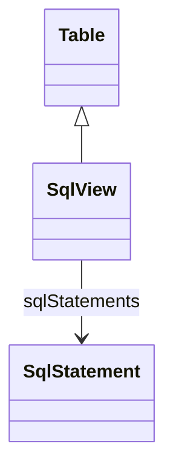

# SqlView

Represents a virtual table defined by SQL query expressions rather than physical database tables. SqlView enables complex data transformations, joins, and calculations to be encapsulated as table sources for OLAP dimensions and measures.
## Extends
- Table [🔗](./class-Table)
## Attributes

<table>
  <thead>
    <tr>
      <th>Name</th>
      <th>Id</th>
      <th>Typ</th>
      <th>Lower</th>
      <th>Upper</th>
    </tr>
  </thead>
  <tbody>
  </tbody>
</table>

## References

<table>
  <thead>
    <tr>
      <th>Name</th>
      <th>Typ</th>
      <th>Lower</th>
      <th>Upper</th>
      <th>Containment</th>
    </tr>
  </thead>
  <tbody>
    <tr>
      <td><strong>sqlStatements</strong></td>
      <td>SqlStatement<a href="./class-SqlStatement">🔗</a></td>
      <td>1</td>
      <td>&infin;</td>
      <td>true</td>
    </tr>
    <tr>
      <td colspan="5"><em>Collection of SQL statements that define this view's query logic. Multiple statements support database-specific implementations, with the OLAP engine selecting the appropriate statement based on the target database dialect.</em></td>
    </tr>
  </tbody>
</table>

## Used by

- SqlSelectQuery[🔗](./class-SqlSelectQuery) → sql

## ClassDiagramm

