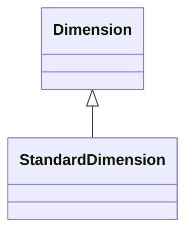

# StandardDimension

General-purpose dimension for non-temporal analytical axes such as Geography, Product Categories, Customer Segments, or any other business classification hierarchy. StandardDimensions provide flexible hierarchical structures with configurable levels, member properties, and ordering rules that can model complex business taxonomies and support drill-down/drill-up navigation patterns.
## Extends
- Dimension [🔗](./class-Dimension)
## Attributes

<table>
  <thead>
    <tr>
      <th>Name</th>
      <th>Id</th>
      <th>Typ</th>
      <th>Lower</th>
      <th>Upper</th>
    </tr>
  </thead>
  <tbody>
  </tbody>
</table>

## References

<table>
  <thead>
    <tr>
      <th>Name</th>
      <th>Typ</th>
      <th>Lower</th>
      <th>Upper</th>
      <th>Containment</th>
    </tr>
  </thead>
  <tbody>
  </tbody>
</table>

## Used by

## ClassDiagramm

