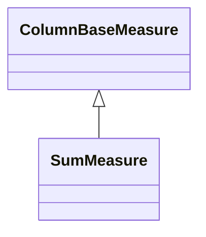

# SumMeasure

A measure that calculates the sum of all values from the referenced column across the aggregated data set. SumMeasure uses the SQL SUM() aggregate function and represents the most common type of OLAP measure for additive metrics like sales amounts, quantities, costs, and revenues. The measure provides fully additive behavior, meaning values can be meaningfully summed across all dimensions. SumMeasure supports fast aggregation for INTEGER and NUMERIC data types and is optimized for pre-aggregated table usage, making it the highest-performance measure type for typical business metrics.
## Extends
- ColumnBaseMeasure [🔗](./class-ColumnBaseMeasure)
## Attributes

<table>
  <thead>
    <tr>
      <th>Name</th>
      <th>Id</th>
      <th>Typ</th>
      <th>Lower</th>
      <th>Upper</th>
    </tr>
  </thead>
  <tbody>
  </tbody>
</table>

## References

<table>
  <thead>
    <tr>
      <th>Name</th>
      <th>Typ</th>
      <th>Lower</th>
      <th>Upper</th>
      <th>Containment</th>
    </tr>
  </thead>
  <tbody>
  </tbody>
</table>

## Used by

## ClassDiagramm

