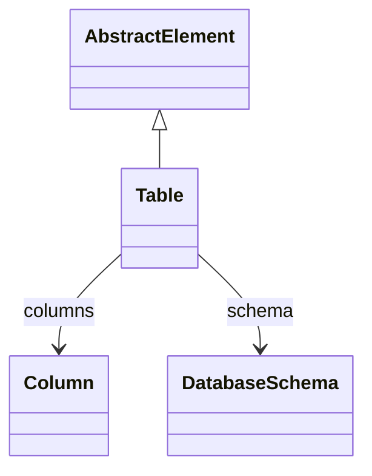

# Table

Abstract base class for database tables that serve as data sources for OLAP operations. Table defines common structure and metadata for physical tables, views, and queries used in dimensional modeling.
## Extends
- AbstractElement [🔗](./class-AbstractElement)
## Attributes

<table>
  <thead>
    <tr>
      <th>Name</th>
      <th>Id</th>
      <th>Typ</th>
      <th>Lower</th>
      <th>Upper</th>
    </tr>
  </thead>
  <tbody>
  </tbody>
</table>

## References

<table>
  <thead>
    <tr>
      <th>Name</th>
      <th>Typ</th>
      <th>Lower</th>
      <th>Upper</th>
      <th>Containment</th>
    </tr>
  </thead>
  <tbody>
    <tr>
      <td><strong>columns</strong></td>
      <td>Column<a href="./class-Column">🔗</a></td>
      <td>0</td>
      <td>&infin;</td>
      <td>true</td>
    </tr>
    <tr>
      <td colspan="5"><em>Collection of columns that define the table structure. Columns specify data types, constraints, and metadata required for OLAP dimension and measure mappings.</em></td>
    </tr>
    <tr>
      <td><strong>schema</strong></td>
      <td>DatabaseSchema<a href="./class-DatabaseSchema">🔗</a></td>
      <td>0</td>
      <td>1</td>
      <td>false</td>
    </tr>
    <tr>
      <td colspan="5"><em>Reference to the parent database schema that contains this table. Establishes the schema-table relationship for proper database organization and namespace management.</em></td>
    </tr>
  </tbody>
</table>

## Used by

- TableQuery[🔗](./class-TableQuery) → table
- AggregationName[🔗](./class-AggregationName) → name
- AccessTableGrant[🔗](./class-AccessTableGrant) → table
- DatabaseSchema[🔗](./class-DatabaseSchema) → tables
- Column[🔗](./class-Column) → table

## ClassDiagramm

