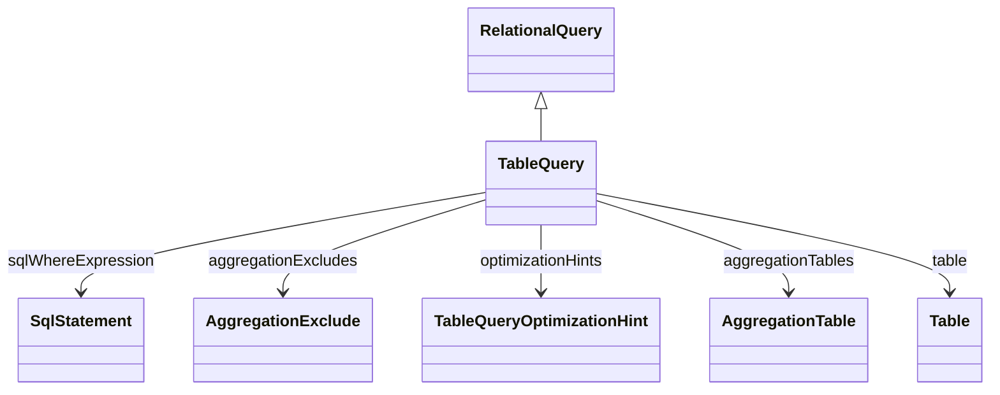

# TableQuery

Represents a direct query against a physical database table, providing the most common and straightforward data access pattern in OLAP applications. TableQuery serves as the foundation for fact table access, dimension table queries, and lookup table operations, enabling the OLAP engine to generate optimized SQL SELECT statements with appropriate filtering, grouping, and sorting. The query supports advanced performance features including custom WHERE clauses for data filtering, aggregation table specifications for pre-computed summaries, database-specific optimization hints for query tuning, and aggregation exclusion rules for controlling when summary tables should not be used. TableQuery is essential for both star schema and snowflake schema implementations, providing the direct table access needed for member loading, measure aggregation, and dimensional navigation.
## Extends
- RelationalQuery [🔗](./class-RelationalQuery)
## Attributes

<table>
  <thead>
    <tr>
      <th>Name</th>
      <th>Id</th>
      <th>Typ</th>
      <th>Lower</th>
      <th>Upper</th>
    </tr>
  </thead>
  <tbody>
  </tbody>
</table>

## References

<table>
  <thead>
    <tr>
      <th>Name</th>
      <th>Typ</th>
      <th>Lower</th>
      <th>Upper</th>
      <th>Containment</th>
    </tr>
  </thead>
  <tbody>
    <tr>
      <td><strong>sqlWhereExpression</strong></td>
      <td>SqlStatement<a href="./class-SqlStatement">🔗</a></td>
      <td>0</td>
      <td>1</td>
      <td>true</td>
    </tr>
    <tr>
      <td colspan="5"><em>Optional SQL WHERE clause expression that filters the table data before processing by the OLAP engine. This enables pre-filtering of large tables to improve performance, restrict data access based on security requirements, or limit analysis to specific business contexts such as current fiscal year data, active customers, or specific product categories. The WHERE expression is integrated into the generated SQL and can reference any columns available in the table, supporting complex filtering logic including subqueries, functions, and multi-condition expressions.</em></td>
    </tr>
    <tr>
      <td><strong>aggregationExcludes</strong></td>
      <td>AggregationExclude<a href="./class-AggregationExclude">🔗</a></td>
      <td>0</td>
      <td>&infin;</td>
      <td>true</td>
    </tr>
    <tr>
      <td colspan="5"><em>Collection of rules that specify when aggregation tables should not be used for this query, providing fine-grained control over performance optimization strategies. Aggregation exclusion rules can be based on specific cube contexts, measure combinations, or query patterns where using pre-computed aggregations would be inappropriate or incorrect. This feature is essential for maintaining data accuracy in scenarios where aggregation tables may not contain all necessary detail or where real-time data access is required despite performance implications.</em></td>
    </tr>
    <tr>
      <td><strong>optimizationHints</strong></td>
      <td>TableQueryOptimizationHint<a href="./class-TableQueryOptimizationHint">🔗</a></td>
      <td>0</td>
      <td>&infin;</td>
      <td>true</td>
    </tr>
    <tr>
      <td colspan="5"><em>Collection of database-specific optimization hints that can be embedded in generated SQL queries to influence query execution plans, indexing strategies, and performance characteristics. Optimization hints enable fine-tuning of query performance for specific database systems and can include instructions for index usage, join algorithms, parallel processing, or memory allocation. These hints are particularly valuable for large-scale OLAP deployments where query performance is critical and database-specific tuning is required.</em></td>
    </tr>
    <tr>
      <td><strong>aggregationTables</strong></td>
      <td>AggregationTable<a href="./class-AggregationTable">🔗</a></td>
      <td>0</td>
      <td>&infin;</td>
      <td>false</td>
    </tr>
    <tr>
      <td colspan="5"><em>Collection of pre-computed aggregation tables that can be used to accelerate queries against this table by providing pre-calculated summaries at various levels of granularity. Aggregation tables contain rolled-up measures and dimension keys that enable the OLAP engine to answer queries from summary data rather than processing detailed facts, significantly improving query performance for common analytical scenarios. The OLAP engine automatically selects the most appropriate aggregation table based on query requirements and availability.</em></td>
    </tr>
    <tr>
      <td><strong>table</strong></td>
      <td>Table<a href="./class-Table">🔗</a></td>
      <td>1</td>
      <td>1</td>
      <td>false</td>
    </tr>
    <tr>
      <td colspan="5"><em>Reference to the physical database table that serves as the data source for this query. The table provides the schema definition including column names, data types, and structural information needed for proper SQL generation and data access. The table reference establishes the foundation for all data operations and must be accessible within the database schema context defined by the OLAP catalog configuration.</em></td>
    </tr>
  </tbody>
</table>

## Used by

- ParentChildLink[🔗](./class-ParentChildLink) → table

## ClassDiagramm

