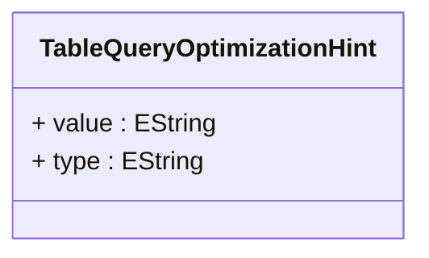

# TableQueryOptimizationHint

Provides database-specific optimization hints that can be embedded in generated SQL queries to influence query execution plans, performance characteristics, and resource utilization patterns for optimal analytical query performance.
## Extends

## Attributes

<table>
  <thead>
    <tr>
      <th>Name</th>
      <th>Id</th>
      <th>Typ</th>
      <th>Lower</th>
      <th>Upper</th>
    </tr>
  </thead>
  <tbody>
    <tr>
      <td><strong>value</strong></td>
      <td>false</td>
      <td><em>EString</em></td>
      <td>0</td>
      <td>1</td>
    </tr>
    <tr>
      <td colspan="5"><em>Database-specific hint value that contains the actual optimization instruction or parameter that will be embedded in generated SQL statements. The value format and syntax depends on the database platform and hint type, enabling precise control over database query execution behavior. Common hint values include index names for index usage hints, join algorithm specifications for join strategy hints, parallel degree numbers for parallel processing hints, and memory size specifications for resource allocation hints. The value enables fine-grained performance tuning that can adapt to specific database configurations, data volumes, and performance requirements.</em></td>
    </tr>
    <tr>
      <td><strong>type</strong></td>
      <td>false</td>
      <td><em>EString</em></td>
      <td>1</td>
      <td>1</td>
    </tr>
    <tr>
      <td colspan="5"><em>Classification of the optimization hint that determines how the hint value should be interpreted and applied during SQL generation. The type enables the OLAP engine to properly format and position hints within generated SQL statements according to database-specific syntax requirements. Common hint types include index hints for controlling index usage, join hints for specifying join algorithms, parallel hints for enabling parallel query execution, and cache hints for controlling result caching behavior. The type ensures that optimization hints are applied correctly across different database platforms and query patterns.</em></td>
    </tr>
  </tbody>
</table>

## References

<table>
  <thead>
    <tr>
      <th>Name</th>
      <th>Typ</th>
      <th>Lower</th>
      <th>Upper</th>
      <th>Containment</th>
    </tr>
  </thead>
  <tbody>
  </tbody>
</table>

## Used by

- TableQuery[🔗](./class-TableQuery) → optimizationHints

## ClassDiagramm

