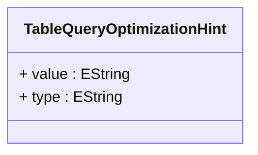

# TableQueryOptimizationHint

Provides database-specific optimization hints that can be embedded in generated SQL queries to influence query execution plans, performance characteristics, and resource utilization patterns for optimal analytical query performance. TableQueryOptimizationHint represents a sophisticated performance tuning mechanism that enables OLAP applications to leverage database-specific optimization features, advanced indexing strategies, parallel processing capabilities, and specialized query execution techniques that can dramatically improve query performance for large-scale analytical workloads. This optimization capability is essential for enterprise OLAP deployments where query performance is critical for user experience and where database-specific tuning can provide significant performance advantages over generic SQL generation. Optimization hints support advanced performance scenarios including index usage hints that can force or suggest specific index utilization patterns, join algorithm hints that can specify optimal join strategies for large table operations, parallel processing hints that can enable multi-threaded query execution for complex analytical operations, memory allocation hints that can optimize buffer usage for large result sets, and caching hints that can influence query result caching strategies. The hint framework supports multiple database platforms with platform-specific hint syntaxes, enables conditional hint application based on query characteristics or data volumes, and integrates seamlessly with the OLAP SQL generation engine to provide transparent performance optimization that doesn't require changes to analytical applications or user interfaces.
## Extends

## Attributes

<table>
  <thead>
    <tr>
      <th>Name</th>
      <th>Id</th>
      <th>Typ</th>
      <th>Lower</th>
      <th>Upper</th>
    </tr>
  </thead>
  <tbody>
    <tr>
      <td><strong>value</strong></td>
      <td>false</td>
      <td><em>EString</em></td>
      <td>0</td>
      <td>1</td>
    </tr>
    <tr>
      <td colspan="5"><em>Database-specific hint value that contains the actual optimization instruction or parameter that will be embedded in generated SQL statements. The value format and syntax depends on the database platform and hint type, enabling precise control over database query execution behavior. Common hint values include index names for index usage hints, join algorithm specifications for join strategy hints, parallel degree numbers for parallel processing hints, and memory size specifications for resource allocation hints. The value enables fine-grained performance tuning that can adapt to specific database configurations, data volumes, and performance requirements.</em></td>
    </tr>
    <tr>
      <td><strong>type</strong></td>
      <td>false</td>
      <td><em>EString</em></td>
      <td>1</td>
      <td>1</td>
    </tr>
    <tr>
      <td colspan="5"><em>Classification of the optimization hint that determines how the hint value should be interpreted and applied during SQL generation. The type enables the OLAP engine to properly format and position hints within generated SQL statements according to database-specific syntax requirements. Common hint types include index hints for controlling index usage, join hints for specifying join algorithms, parallel hints for enabling parallel query execution, and cache hints for controlling result caching behavior. The type ensures that optimization hints are applied correctly across different database platforms and query patterns.</em></td>
    </tr>
  </tbody>
</table>

## References

<table>
  <thead>
    <tr>
      <th>Name</th>
      <th>Typ</th>
      <th>Lower</th>
      <th>Upper</th>
      <th>Containment</th>
    </tr>
  </thead>
  <tbody>
  </tbody>
</table>

## Used by

- TableQuery[🔗](./class-TableQuery) → optimizationHints

## ClassDiagramm

