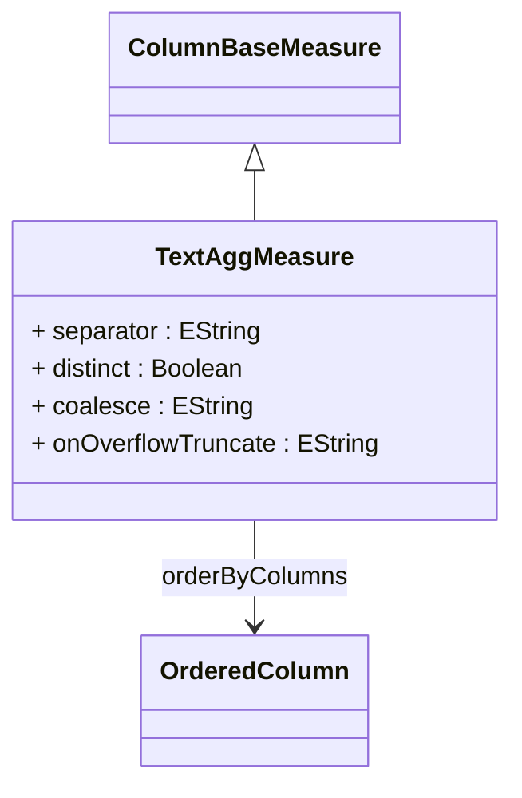

# TextAggMeasure

A specialized measure that concatenates text values from the referenced column across the aggregated data set, creating a single string result from multiple text entries. TextAggMeasure is ideal for combining comments, descriptions, tags, or other textual data into unified displays. The measure supports custom separators, ordering of concatenated values, duplicate handling, and null value management. Common use cases include creating summary comment fields, combining product features, aggregating customer feedback, or building comma-separated lists of related items for analytical reporting.
## Extends
- ColumnBaseMeasure [🔗](./class-ColumnBaseMeasure)
## Attributes

<table>
  <thead>
    <tr>
      <th>Name</th>
      <th>Id</th>
      <th>Typ</th>
      <th>Lower</th>
      <th>Upper</th>
    </tr>
  </thead>
  <tbody>
    <tr>
      <td><strong>separator</strong></td>
      <td>false</td>
      <td><em>EString</em></td>
      <td>0</td>
      <td>1</td>
    </tr>
    <tr>
      <td colspan="5"><em>String value used to separate individual text values when concatenating them into the final result. Common separators include ', ' (comma-space), '; ' (semicolon-space), ' | ' (pipe), or newline characters. If not specified, values are concatenated without separation. The separator choice should match the intended use case and display requirements for the aggregated text.</em></td>
    </tr>
    <tr>
      <td><strong>distinct</strong></td>
      <td>false</td>
      <td><em>Boolean</em></td>
      <td>0</td>
      <td>1</td>
    </tr>
    <tr>
      <td colspan="5"><em>Boolean flag that controls whether duplicate text values are included in the concatenation. When set to true (default), only unique text values are included in the result, preventing repetitive text in the aggregated output. When false, all values including duplicates are concatenated, which may be useful for frequency-based text analysis or when repetition provides meaningful information.</em></td>
    </tr>
    <tr>
      <td><strong>coalesce</strong></td>
      <td>false</td>
      <td><em>EString</em></td>
      <td>0</td>
      <td>1</td>
    </tr>
    <tr>
      <td colspan="5"><em>Default text value to use when encountering null or empty values during concatenation. This prevents null values from creating gaps or unexpected results in the aggregated text. Common coalesce values include '[Empty]', 'N/A', or empty string. If not specified, null values are simply ignored during the concatenation process.</em></td>
    </tr>
    <tr>
      <td><strong>onOverflowTruncate</strong></td>
      <td>false</td>
      <td><em>EString</em></td>
      <td>0</td>
      <td>1</td>
    </tr>
    <tr>
      <td colspan="5"><em>Behavior specification for handling text concatenation results that exceed database column size limits or application constraints. This attribute defines how the system should respond when the aggregated text becomes too long, such as truncating at a specific length, adding ellipsis, or applying other overflow handling strategies to maintain data integrity and display consistency.</em></td>
    </tr>
  </tbody>
</table>

## References

<table>
  <thead>
    <tr>
      <th>Name</th>
      <th>Typ</th>
      <th>Lower</th>
      <th>Upper</th>
      <th>Containment</th>
    </tr>
  </thead>
  <tbody>
    <tr>
      <td><strong>orderByColumns</strong></td>
      <td>OrderedColumn<a href="./class-OrderedColumn">🔗</a></td>
      <td>1</td>
      <td>&infin;</td>
      <td>false</td>
    </tr>
    <tr>
      <td colspan="5"><em>Collection of ordered columns that determine the sequence in which text values are concatenated. The ordering is crucial for creating meaningful text aggregations where the sequence of values matters, such as chronological comments, ranked lists, or priority-ordered descriptions. At least one OrderedColumn must be specified to ensure consistent and predictable text concatenation results across different query executions.</em></td>
    </tr>
  </tbody>
</table>

## Used by

## ClassDiagramm

