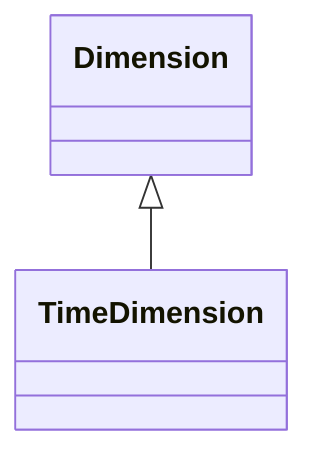

# TimeDimension

Specialized dimension for temporal analysis, providing built-in support for time-based hierarchies (Year-Quarter-Month-Day), time intelligence calculations, and temporal navigation. TimeDimensions enable sophisticated time-based analytics including period-over-period comparisons, year-to-date calculations, and time-based filtering. The dimension automatically understands temporal relationships and provides optimized query performance for time-based operations.
## Extends
- Dimension [🔗](./class-Dimension)
## Attributes

<table>
  <thead>
    <tr>
      <th>Name</th>
      <th>Id</th>
      <th>Typ</th>
      <th>Lower</th>
      <th>Upper</th>
    </tr>
  </thead>
  <tbody>
  </tbody>
</table>

## References

<table>
  <thead>
    <tr>
      <th>Name</th>
      <th>Typ</th>
      <th>Lower</th>
      <th>Upper</th>
      <th>Containment</th>
    </tr>
  </thead>
  <tbody>
  </tbody>
</table>

## Used by

## ClassDiagramm

