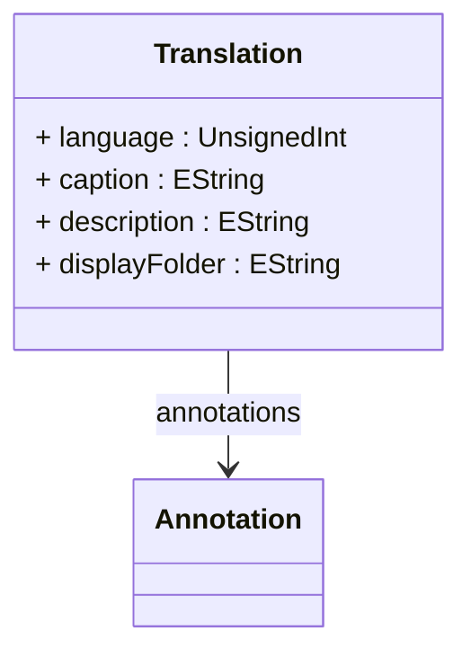

# Translation

Provides comprehensive internationalization and localization support for OLAP metadata elements, enabling multi-language deployments where analytical content can be presented in different languages based on user preferences, regional requirements, or organizational policies. Translation represents a fundamental component of the OLAP globalization framework, supporting complex multinational enterprise scenarios where the same analytical model must serve users who speak different languages and operate within different cultural contexts. This capability is essential for global organizations that need to provide consistent analytical experiences across different geographic regions while respecting local language preferences, cultural formatting conventions, and business terminology variations. Translation objects enable sophisticated localization strategies including region-specific business terminology where the same analytical concept may be expressed differently in different markets, cultural adaptation where display folders and organizational structures reflect local business practices, regulatory compliance where certain terms must be presented in official local languages, and user experience optimization where analytical interfaces can be dynamically adapted to user language preferences. The translation system integrates seamlessly with client tools and XMLA protocols to provide automatic language resolution, supports hierarchical translation inheritance where child elements can inherit parent translations when specific translations are not available, and enables efficient translation management through centralized translation repositories and automated translation workflow processes that support large-scale multinational OLAP deployments.
## Extends

## Attributes

<table>
  <thead>
    <tr>
      <th>Name</th>
      <th>Id</th>
      <th>Typ</th>
      <th>Lower</th>
      <th>Upper</th>
    </tr>
  </thead>
  <tbody>
    <tr>
      <td><strong>language</strong></td>
      <td>false</td>
      <td><em>UnsignedInt</em></td>
      <td>1</td>
      <td>1</td>
    </tr>
    <tr>
      <td colspan="5"><em>Language identifier specified as a Windows LCID (Locale Identifier) that uniquely determines the target language and cultural context for this translation. The LCID encompasses both language and regional variations, enabling precise localization that accounts for cultural differences within the same language family, such as distinguishing between US English (1033), UK English (2057), Canadian French (3084), and France French (1036). This approach ensures that translations can address not only linguistic differences but also cultural formatting preferences, business terminology variations, and region-specific regulatory requirements. The LCID system supports comprehensive globalization scenarios including multinational corporations that operate in multiple regions with the same language but different business practices, regulatory environments that require specific terminology in official languages, and user experience customization where individuals can select their preferred cultural context even when working with the same underlying analytical data and business logic.</em></td>
    </tr>
    <tr>
      <td><strong>caption</strong></td>
      <td>false</td>
      <td><em>EString</em></td>
      <td>0</td>
      <td>1</td>
    </tr>
    <tr>
      <td colspan="5"><em>Localized display caption that appears in client tools, reports, and user interfaces for the associated OLAP element in the specified language. The caption provides the primary user-visible text that represents the element in analytical tools, dimension browsers, measure lists, and other user-facing components of the OLAP system. This translation capability enables sophisticated multilingual user experiences where the same analytical model can present familiar, culturally appropriate terminology to users in different regions while maintaining consistent underlying business logic and data structures. Caption translations support complex business scenarios including global brand management where product names may vary by region, organizational terminology where department or role names reflect local business structures, financial reporting where account names must conform to local accounting standards, and customer-facing analytics where terminology must align with local market communication strategies.</em></td>
    </tr>
    <tr>
      <td><strong>description</strong></td>
      <td>false</td>
      <td><em>EString</em></td>
      <td>0</td>
      <td>1</td>
    </tr>
    <tr>
      <td colspan="5"><em>Detailed localized description that provides comprehensive explanatory text for the OLAP element in the specified language, supporting user training, system documentation, and contextual help within analytical applications. Descriptions enable rich multilingual metadata that goes beyond simple captions to provide detailed explanations of business concepts, calculation methodologies, data sources, and usage guidelines that help users understand and effectively utilize analytical resources. This descriptive translation capability is particularly valuable for complex analytical models where users need detailed explanations of sophisticated calculations, business rules, data quality considerations, and appropriate usage contexts. Localized descriptions support advanced user assistance scenarios including self-service analytics where users need detailed guidance to navigate complex dimensional models, regulatory compliance documentation where calculation methodologies must be explained in official languages, training and onboarding programs where new users need comprehensive explanations of analytical concepts, and administrative documentation where system operators need detailed metadata for maintenance and troubleshooting purposes.</em></td>
    </tr>
    <tr>
      <td><strong>displayFolder</strong></td>
      <td>false</td>
      <td><em>EString</em></td>
      <td>0</td>
      <td>1</td>
    </tr>
    <tr>
      <td colspan="5"><em>Localized organizational folder path that determines how the OLAP element is categorized and presented within client tool navigation structures for the specified language and cultural context. Display folders enable culturally appropriate organizational schemes where the logical grouping and categorization of analytical elements reflects local business practices, terminology preferences, and organizational structures that may vary significantly across different regions and cultures. This localization capability supports sophisticated international deployment scenarios including regional business organization where analytical elements are grouped according to local business unit structures, cultural terminology preferences where the same logical groupings are expressed using locally familiar terms and concepts, regulatory compliance requirements where certain analytical elements must be organized according to official local classification schemes, and user experience optimization where navigation structures reflect the cognitive models and business workflows that are most familiar to users in specific cultural contexts. The display folder translation system enables hierarchical folder structures with forward-slash notation, supports inheritance patterns where elements can be automatically organized based on parent element translations, and integrates with client tool metadata browsers to provide intuitive, culturally appropriate navigation experiences for multinational analytical deployments.</em></td>
    </tr>
  </tbody>
</table>

## References

<table>
  <thead>
    <tr>
      <th>Name</th>
      <th>Typ</th>
      <th>Lower</th>
      <th>Upper</th>
      <th>Containment</th>
    </tr>
  </thead>
  <tbody>
    <tr>
      <td><strong>annotations</strong></td>
      <td>Annotation<a href="./class-Annotation">🔗</a></td>
      <td>0</td>
      <td>&infin;</td>
      <td>true</td>
    </tr>
    <tr>
      <td colspan="5"><em>Collection of Annotation objects that provide additional metadata, custom properties, and extensibility mechanisms for this translation, enabling sophisticated translation management capabilities that support advanced localization requirements, workflow integration, and specialized translation processing scenarios. Translation annotations enable comprehensive metadata management where translation entries can be enhanced with quality assurance information, approval workflow states, source system references, translation version tracking, and cultural adaptation notes that support professional translation management processes in large-scale multinational analytical deployments. This annotation capability is essential for enterprise globalization scenarios where translation management requires sophisticated metadata including translation quality scores, reviewer information, approval timestamps, cultural adaptation notes, and integration data that connects translations to external translation management systems, content management platforms, and collaborative translation workflows. The annotations support complex translation lifecycle management including translation review and approval processes where quality assurance metadata tracks translation accuracy and cultural appropriateness, version control scenarios where translation evolution is tracked through detailed metadata, integration scenarios where translations are synchronized with external localization systems, and audit trail requirements where translation changes must be documented for compliance and governance purposes while maintaining optimal system performance and enabling efficient translation management across diverse analytical environments and complex multinational business intelligence implementations.</em></td>
    </tr>
  </tbody>
</table>

## Used by

- Kpi[🔗](./class-Kpi) → translations

## ClassDiagramm

