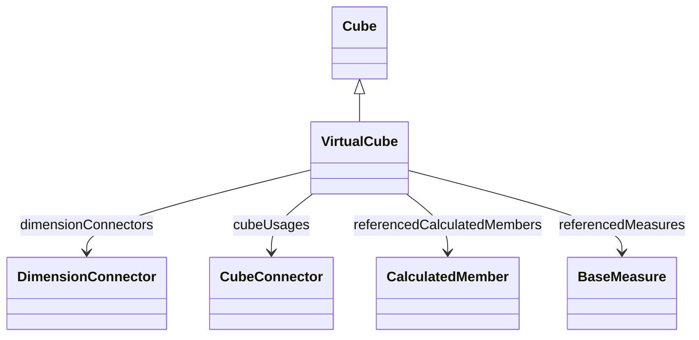

# VirtualCube

A virtual cube that combines measures and dimensions from multiple physical cubes into a unified analytical view. Virtual cubes enable cross-cube analysis by creating a logical integration layer over existing physical cubes, allowing users to analyze related metrics from different business processes in a single query. For example, a virtual cube might combine sales data from a Sales cube with inventory data from an Inventory cube to enable integrated sales and stock analysis. Virtual cubes don't have their own fact tables but instead reference and aggregate data from their constituent physical cubes.
## Extends
- Cube [🔗](./class-Cube)
## Attributes

<table>
  <thead>
    <tr>
      <th>Name</th>
      <th>Id</th>
      <th>Typ</th>
      <th>Lower</th>
      <th>Upper</th>
    </tr>
  </thead>
  <tbody>
  </tbody>
</table>

## References

<table>
  <thead>
    <tr>
      <th>Name</th>
      <th>Typ</th>
      <th>Lower</th>
      <th>Upper</th>
      <th>Containment</th>
    </tr>
  </thead>
  <tbody>
    <tr>
      <td><strong>dimensionConnectors</strong></td>
      <td>DimensionConnector<a href="./class-DimensionConnector">🔗</a></td>
      <td>0</td>
      <td>&infin;</td>
      <td>false</td>
    </tr>
    <tr>
      <td colspan="5"><em>Collection of dimension connectors that define which dimensions are available for analysis in this virtual cube. These connectors typically reference shared dimensions that exist across the constituent physical cubes, enabling consistent slicing and dicing of the combined measures. The virtual cube can only include dimensions that are meaningful and accessible across its constituent cubes to ensure query coherence.</em></td>
    </tr>
    <tr>
      <td><strong>cubeUsages</strong></td>
      <td>CubeConnector<a href="./class-CubeConnector">🔗</a></td>
      <td>1</td>
      <td>&infin;</td>
      <td>true</td>
    </tr>
    <tr>
      <td colspan="5"><em>Collection of cube connectors that specify which physical cubes contribute data to this virtual cube. Each CubeConnector defines how a specific physical cube is integrated, including any dimension mapping, measure selection, and data filtering rules. At least one physical cube must be referenced, and the virtual cube can aggregate and correlate data across all its constituent cubes to provide unified analytical views.</em></td>
    </tr>
    <tr>
      <td><strong>referencedCalculatedMembers</strong></td>
      <td>CalculatedMember<a href="./class-CalculatedMember">🔗</a></td>
      <td>0</td>
      <td>&infin;</td>
      <td>false</td>
    </tr>
    <tr>
      <td colspan="5"><em>Collection of calculated members from constituent physical cubes that should be made available in this virtual cube. This allows the virtual cube to expose complex calculations and derived metrics that were defined in the underlying physical cubes, providing a complete analytical view that includes both base measures and computed values. The virtual cube can selectively include only relevant calculated members for its intended analytical purpose.</em></td>
    </tr>
    <tr>
      <td><strong>referencedMeasures</strong></td>
      <td>BaseMeasure<a href="./class-BaseMeasure">🔗</a></td>
      <td>0</td>
      <td>&infin;</td>
      <td>false</td>
    </tr>
    <tr>
      <td colspan="5"><em>Collection of base measures from constituent physical cubes that should be included in this virtual cube. This defines which specific measures (like Sales Amount, Quantity, Cost) from the underlying physical cubes are made available for analysis in the virtual cube. The virtual cube can selectively expose only the measures that are relevant for its intended analytical scenarios, creating a focused and simplified view for users.</em></td>
    </tr>
  </tbody>
</table>

## Used by

## ClassDiagramm

