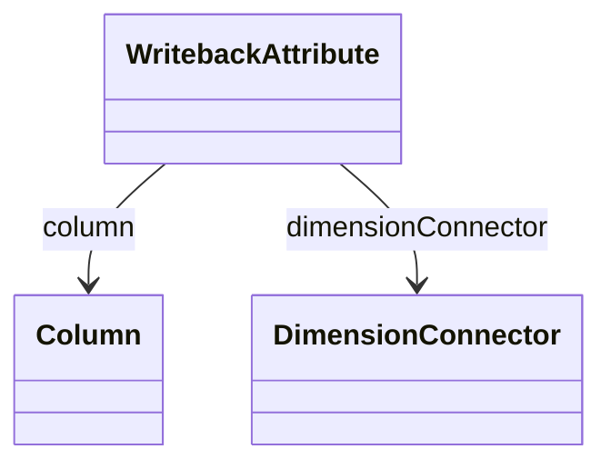

# WritebackAttribute

Defines a dimensional attribute that participates in writeback operations, enabling sophisticated data modification scenarios where users can update dimensional context information alongside measure values through interactive OLAP applications. WritebackAttribute represents a critical component of advanced business intelligence systems that support collaborative planning, budgeting, forecasting, and other scenarios where analytical applications must enable direct data modification rather than read-only consumption. This capability is essential for modern enterprise planning applications where business users need to update forecasts, adjust budgets, modify targets, or correct data errors through intuitive analytical interfaces without requiring technical database knowledge or separate data entry systems. WritebackAttribute supports sophisticated writeback scenarios including dimensional context updates where users can modify member properties, attribute values, or hierarchical relationships as part of comprehensive data maintenance workflows, coordinated writeback operations where dimensional updates are synchronized with measure modifications to maintain data integrity and business logic consistency, and audit-enabled writeback processes where dimensional changes are tracked for compliance, governance, and change management purposes. The writeback attribute capability enables advanced collaborative analytics where multiple users can contribute to data maintenance and planning processes, version-controlled data modification where writeback operations support approval workflows and change management processes, and integrated data maintenance where analytical applications serve as comprehensive data management platforms that combine analytical consumption with sophisticated data modification capabilities while maintaining optimal performance and data integrity across complex enterprise business intelligence environments.
## Extends

## Attributes

<table>
  <thead>
    <tr>
      <th>Name</th>
      <th>Id</th>
      <th>Typ</th>
      <th>Lower</th>
      <th>Upper</th>
    </tr>
  </thead>
  <tbody>
  </tbody>
</table>

## References

<table>
  <thead>
    <tr>
      <th>Name</th>
      <th>Typ</th>
      <th>Lower</th>
      <th>Upper</th>
      <th>Containment</th>
    </tr>
  </thead>
  <tbody>
    <tr>
      <td><strong>column</strong></td>
      <td>Column<a href="./class-Column">🔗</a></td>
      <td>1</td>
      <td>1</td>
      <td>false</td>
    </tr>
    <tr>
      <td colspan="5"><em>Required reference to the database Column that stores the dimensional attribute values that can be modified through writeback operations, establishing the physical data storage location that will receive updated values when users perform dimensional data modifications through analytical applications. The column reference defines the specific database field that will be updated during writeback operations, ensuring that dimensional changes are properly persisted to the underlying data storage while maintaining referential integrity and data consistency across the analytical system. This column specification is fundamental to writeback functionality where dimensional attribute modifications must be accurately reflected in the source database, supporting scenarios such as member property updates where users can modify descriptive attributes, category assignments, or business classifications through analytical interfaces, hierarchical relationship modifications where users can adjust parent-child relationships or level assignments, and attribute value corrections where users can fix data quality issues or update outdated information directly through business intelligence applications. The column reference enables sophisticated writeback architectures including multi-table writeback where dimensional updates can affect multiple related tables, transactional writeback where dimensional changes are coordinated with fact table modifications, and audited writeback where dimensional changes are tracked in audit tables while maintaining optimal performance and data integrity across complex enterprise data management scenarios that require both analytical capability and comprehensive data modification functionality.</em></td>
    </tr>
    <tr>
      <td><strong>dimensionConnector</strong></td>
      <td>DimensionConnector<a href="./class-DimensionConnector">🔗</a></td>
      <td>1</td>
      <td>1</td>
      <td>false</td>
    </tr>
    <tr>
      <td colspan="5"><em>Required reference to the DimensionConnector that defines the relationship between this writeback attribute and the cube's dimensional structure, establishing the analytical context that determines how dimensional attribute modifications are integrated with the cube's multidimensional model and fact data relationships. The dimension connector reference ensures that writeback operations maintain proper dimensional consistency and referential integrity, enabling sophisticated writeback scenarios where dimensional attribute changes are coordinated with related analytical structures and business logic. This connector relationship is essential for comprehensive writeback functionality where dimensional modifications must preserve the analytical coherence of the multidimensional model, supporting scenarios such as hierarchical writeback where attribute changes affect multiple levels of dimensional hierarchies, cross-dimensional writeback where attribute modifications in one dimension may trigger updates in related dimensions, and fact-coordinated writeback where dimensional attribute changes are synchronized with related measure modifications to maintain business logic consistency. The dimension connector reference enables advanced writeback architectures including cascade writeback where dimensional changes propagate through related analytical structures, validated writeback where dimensional modifications are checked against business rules and data integrity constraints, and performance-optimized writeback where dimensional changes are efficiently processed through cube-specific optimization strategies while maintaining comprehensive data consistency and analytical accuracy across complex enterprise business intelligence environments that require both sophisticated analytical capabilities and robust data modification functionality.</em></td>
    </tr>
  </tbody>
</table>

## Used by

- WritebackTable[🔗](./class-WritebackTable) → writebackAttribute

## ClassDiagramm

