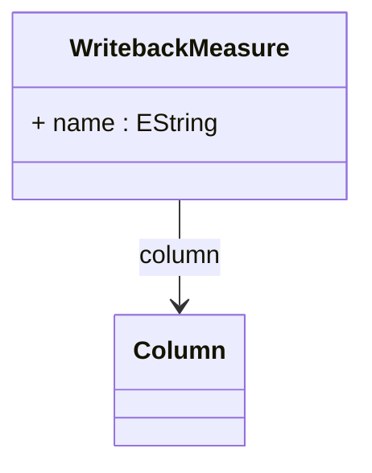

# WritebackMeasure

Defines a measure that participates in writeback operations, enabling sophisticated collaborative planning, budgeting, forecasting, and analytical data modification scenarios where business users can directly update measure values through OLAP client applications and have those changes automatically persisted to designated database tables. WritebackMeasure represents a critical component of modern enterprise business intelligence systems that support active data management alongside traditional analytical consumption, bridging the gap between analytical insight and operational data modification. This capability is fundamental to advanced planning applications where users need to input forecasts, adjust budgets, modify targets, or correct measure values through intuitive analytical interfaces without requiring separate data entry systems or technical database knowledge.
## Extends

## Attributes

<table>
  <thead>
    <tr>
      <th>Name</th>
      <th>Id</th>
      <th>Typ</th>
      <th>Lower</th>
      <th>Upper</th>
    </tr>
  </thead>
  <tbody>
    <tr>
      <td><strong>name</strong></td>
      <td>false</td>
      <td><em>EString</em></td>
      <td>0</td>
      <td>1</td>
    </tr>
    <tr>
      <td colspan="5"><em>Logical name identifier for the measure that will be modified through writeback operations. This name is used to reference the measure in allocation policies and writeback procedures, corresponding to the measure definition in the cube schema.</em></td>
    </tr>
  </tbody>
</table>

## References

<table>
  <thead>
    <tr>
      <th>Name</th>
      <th>Typ</th>
      <th>Lower</th>
      <th>Upper</th>
      <th>Containment</th>
    </tr>
  </thead>
  <tbody>
    <tr>
      <td><strong>column</strong></td>
      <td>Column<a href="./class-Column">🔗</a></td>
      <td>1</td>
      <td>1</td>
      <td>false</td>
    </tr>
    <tr>
      <td colspan="5"><em>Required reference to the database Column that stores the measure values that can be modified through writeback operations, establishing the physical data storage location where updated measure values will be persisted when users perform analytical data modifications. The column reference defines the specific database field that will receive new measure values during writeback operations, ensuring that measure modifications are properly written to the designated writeback table structure while maintaining data integrity and supporting sophisticated allocation algorithms. This column specification is fundamental to writeback functionality where measure value changes must be accurately reflected in the database, supporting scenarios such as budget planning where users input financial targets through analytical interfaces, sales forecasting where measure values represent predicted outcomes, resource planning where capacity and allocation measures are collaboratively modified, and performance management where target values are established through interactive analytical applications. The column reference enables sophisticated writeback architectures including measure allocation where single user inputs are distributed across multiple atomic cells based on allocation policies like equal allocation, weighted allocation, equal increment, and weighted increment, audit-enabled writeback where measure changes are tracked with user identification and timestamps, and coordinated writeback where measure modifications are synchronized with related dimensional attribute changes to maintain analytical consistency. Advanced implementations leverage the column reference for comprehensive writeback scenarios including scenario-based planning where different measure value versions are maintained for comparative analysis, collaborative planning where multiple users contribute measure modifications through shared analytical environments, and performance-optimized writeback where measure updates are efficiently processed through specialized SQL generation and database connection management while maintaining data accuracy and system reliability across complex enterprise business intelligence deployments.</em></td>
    </tr>
  </tbody>
</table>

## Used by

- WritebackTable[🔗](./class-WritebackTable) → writebackMeasure

## ClassDiagramm

