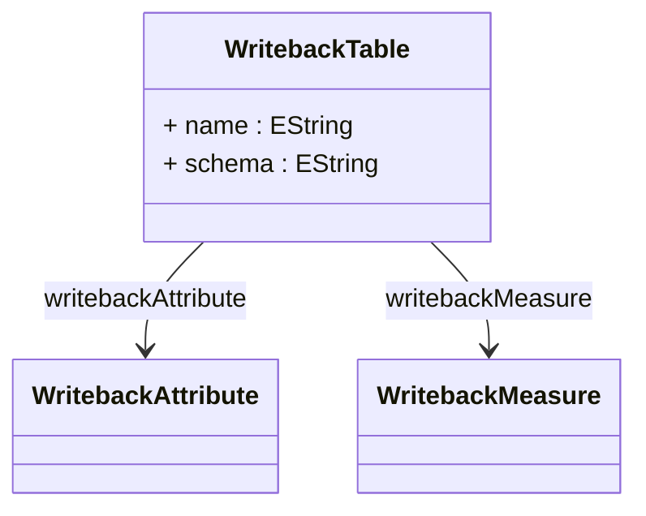

# WritebackTable

Defines the physical database table structure that receives modified analytical data when users perform writeback operations. Maps cube measures and dimensional attributes to specific database columns where user modifications are persisted. Required for cubes that support data modification through OLAP interfaces. Integrates with WritebackUtil for SQL generation and allocation policy processing.
## Extends

## Attributes

<table>
  <thead>
    <tr>
      <th>Name</th>
      <th>Id</th>
      <th>Typ</th>
      <th>Lower</th>
      <th>Upper</th>
    </tr>
  </thead>
  <tbody>
    <tr>
      <td><strong>name</strong></td>
      <td>false</td>
      <td><em>EString</em></td>
      <td>1</td>
      <td>1</td>
    </tr>
    <tr>
      <td colspan="5"><em>Database table name where writeback data is stored. Used by WritebackUtil.commit() to generate SQL INSERT statements. Must contain columns matching the WritebackMeasure and WritebackAttribute definitions plus system columns (ID, USER).</em></td>
    </tr>
    <tr>
      <td><strong>schema</strong></td>
      <td>false</td>
      <td><em>EString</em></td>
      <td>0</td>
      <td>1</td>
    </tr>
    <tr>
      <td colspan="5"><em>Optional database schema name qualifying the writeback table. When specified, used to construct fully qualified table names in SQL statements. Supports database environments requiring schema-based table organization.</em></td>
    </tr>
  </tbody>
</table>

## References

<table>
  <thead>
    <tr>
      <th>Name</th>
      <th>Typ</th>
      <th>Lower</th>
      <th>Upper</th>
      <th>Containment</th>
    </tr>
  </thead>
  <tbody>
    <tr>
      <td><strong>writebackAttribute</strong></td>
      <td>WritebackAttribute<a href="./class-WritebackAttribute">🔗</a></td>
      <td>0</td>
      <td>&infin;</td>
      <td>true</td>
    </tr>
    <tr>
      <td colspan="5"><em>Collection of dimensional attributes that will be included in writeback operations. Each WritebackAttribute maps a dimension's members to database columns in the writeback table. Used to maintain dimensional context when persisting modified measure values.</em></td>
    </tr>
    <tr>
      <td><strong>writebackMeasure</strong></td>
      <td>WritebackMeasure<a href="./class-WritebackMeasure">🔗</a></td>
      <td>0</td>
      <td>&infin;</td>
      <td>true</td>
    </tr>
    <tr>
      <td colspan="5"><em>Collection of measures that can be modified through writeback operations. Each WritebackMeasure maps a cube measure to a database column where modified values are stored. Supports allocation policies (equal, weighted, increment) for distributing values across atomic cells.</em></td>
    </tr>
  </tbody>
</table>

## Used by

- PhysicalCube[🔗](./class-PhysicalCube) → writebackTable

## ClassDiagramm

