# 🧩 Introduction: Model Structure and Class Overview

This chapter provides a comprehensive overview of all classes and enumerations defined in the EMF Ecore model. Each section focuses on a single class or enum, presenting its full structure, including:

- Attributes and their types
- References to other model elements
- Cardinalities, Containsments and default values
- Usage relationships across the model
- A visual diagram for better understanding

The documentation is generated directly from the Ecore/XMI representation of the model, ensuring consistency with the underlying formal definition.

Unlike formats such as JSON or YAML, XMI is a model-oriented serialization designed for structural clarity and type safety. It captures the semantics and relationships of your model elements explicitly, making it the preferred format for precise and scalable domain modeling.

Use this section to explore how the individual elements of your model are defined and how they interconnect — both structurally and semantically.

## Package: rolapmapping
URI: `https://www.daanse.org/spec/org.eclipse.daanse.rolap.mapping`
Prefix: `roma`

Eclipse Daanse ROLAP Mapping EMF Package - Enterprise-grade metamodel framework for defining comprehensive multidimensional analytical schemas, OLAP cube architectures, and sophisticated business intelligence data structures in Relational OLAP (ROLAP) systems. This EMF-based modeling framework represents the culmination of decades of OLAP research and enterprise deployment experience, providing a complete type system that seamlessly bridges the conceptual gap between traditional relational database structures and advanced multidimensional analytical paradigms required for modern business intelligence applications. Supports database schema modeling, multidimensional cube architectures, hierarchical dimensional modeling, advanced measure calculations, comprehensive security frameworks, aggregation optimization, writeback capabilities, cross-database compatibility, SQL integration, KPI management, and enterprise deployment patterns.

## PackageDiagram

A full overview of the package is given in the following diagram. It shows all classes and enums, their attributes and references. In the Pages of the Classes are diagrams with the Focus on the Class itself and only the related Classes.

```mermaid
classDiagram
  class Documentation {
      + title : EString
      + value : EString
      + orderMajor : EInt
      + orderMinor : EInt
      + orderMicro : EInt
      + showContainer : EBoolean
      + showContainments : EInt
  }

  class DocumentedElement {
  }
    DocumentedElement --> Documentation : documentations

  class Annotation {
      + value : EString
      + name : EString
  }

  class AbstractElement {
      + id : EString
      + description : EString
      + name : EString
  }
    AbstractElement --> Annotation : annotations

  class Catalog {
      + measuresDimensionName : EString
  }
    Catalog --> Parameter : parameters
    Catalog --> Cube : cubes
    Catalog --> NamedSet : namedSets
    Catalog --> AccessRole : accessRoles
    Catalog --> AccessRole : defaultAccessRole
    Catalog --> DatabaseSchema : dbschemas

  class Cube {
      + enabled : Boolean
      + visible : Boolean
  }
    Cube --> CalculatedMember : calculatedMembers
    Cube --> NamedSet : namedSets
    Cube --> Kpi : kpis
    Cube --> Member : defaultMeasure

  class PhysicalCube {
      + cache : Boolean
  }
    PhysicalCube --> DimensionConnector : dimensionConnectors
    PhysicalCube --> Query : query
    PhysicalCube --> WritebackTable : writebackTable
    PhysicalCube --> Action : action
    PhysicalCube --> MeasureGroup : measureGroups

  class VirtualCube {
  }
    VirtualCube --> DimensionConnector : dimensionConnectors
    VirtualCube --> CubeConnector : cubeUsages
    VirtualCube --> CalculatedMember : referencedCalculatedMembers
    VirtualCube --> BaseMeasure : referencedMeasures

  class CubeConnector {
      + ignoreUnrelatedDimensions : Boolean
  }
    CubeConnector --> Cube : cube

  class MeasureGroup {
      + name : EString
  }
    MeasureGroup --> BaseMeasure : measures
    MeasureGroup --> PhysicalCube : physicalCube

  class Member {
      + displayFolder : EString
      + visible : Boolean
      + formatString : EString
  }
    Member --> CalculatedMemberProperty : calculatedMemberProperties
    Member --> CellFormatter : cellFormatter

  class MinMeasure {
  }

  class MaxMeasure {
  }

  class SumMeasure {
  }

  class AvgMeasure {
  }

  class NoneMeasure {
  }

  class CountMeasure {
      + distinct : Boolean
  }

  class TextAggMeasure {
      + separator : EString
      + distinct : Boolean
      + coalesce : EString
      + onOverflowTruncate : EString
  }
    TextAggMeasure --> OrderedColumn : orderByColumns

  class BitAggMeasure {
      + aggType : BitAggType
      + not : Boolean
  }

  class PercentileMeasure {
      + percentType : PercentType
      + percentile : Double
  }
    PercentileMeasure --> OrderedColumn : column

  class NthAggMeasure {
      + ignoreNulls : Boolean
      + n : EIntegerObject
  }
    NthAggMeasure --> OrderedColumn : orderByColumns

  class CustomMeasure {
      + template : EString
      + properties : EString
  }
    CustomMeasure --> Column : columns

  class SQLExpressionBaseMeasure {
  }
    SQLExpressionBaseMeasure --> SQLExpressionColumn : column

  class ColumnBaseMeasure {
  }
    ColumnBaseMeasure --> Column : column

  class BaseMeasure {
      + backColor : EString
      + dataType : ColumnInternalDataType
      + formatter : EString
  }
    BaseMeasure --> MeasureGroup : measureGroup

  class Kpi {
      + displayFolder : EString
      + associatedMeasureGroupID : EString
      + value : EString
      + goal : EString
      + status : EString
      + trend : EString
      + weight : EString
      + trendGraphic : EString
      + statusGraphic : EString
      + currentTimeMember : EString
  }
    Kpi --> Translation : translations
    Kpi --> Kpi : parentKpi

  class NamedSet {
      + displayFolder : EString
      + formula : Formula
  }

  class Dimension {
      + usagePrefix : EString
      + visible : Boolean
  }
    Dimension --> Hierarchy : hierarchies
    Dimension --> Hierarchy : defaultHierarchy

  class DimensionConnector {
      + usagePrefix : EString
      + visible : Boolean
      + overrideDimensionName : EString
      + id : EString
  }
    DimensionConnector --> Column : foreignKey
    DimensionConnector --> Dimension : dimension
    DimensionConnector --> Level : level
    DimensionConnector --> PhysicalCube : physicalCube

  class TimeDimension {
  }

  class StandardDimension {
  }

  class Hierarchy {
      + allLevelName : EString
      + allMemberCaption : EString
      + allMemberName : EString
      + defaultMember : EString
      + displayFolder : EString
      + hasAll : Boolean
      + memberReaderClass : EString
      + origin : EString
      + uniqueKeyLevelName : EString
      + visible : Boolean
  }
    Hierarchy --> MemberReaderParameter : memberReaderParameters
    Hierarchy --> Column : primaryKey
    Hierarchy --> Query : query

  class Level {
      + approxRowCount : EString
      + hideMemberIf : HideMemberIf
      + type : LevelDefinition
      + columnType : ColumnInternalDataType
      + uniqueMembers : Boolean
      + visible : Boolean
  }
    Level --> MemberProperty : memberProperties
    Level --> MemberFormatter : memberFormatter
    Level --> Column : captionColumn
    Level --> Column : column
    Level --> Column : nameColumn
    Level --> Column : ordinalColumn

  class ExplicitHierarchy {
  }
    ExplicitHierarchy --> Level : levels

  class ParentChildHierarchy {
      + nullParentValue : EString
      + parentAsLeafEnable : Boolean
      + parentAsLeafNameFormat : EString
  }
    ParentChildHierarchy --> ParentChildLink : parentChildLink
    ParentChildHierarchy --> Column : parentColumn
    ParentChildHierarchy --> Level : level

  class MemberProperty {
      + dependsOnLevelValue : Boolean
      + propertyType : ColumnInternalDataType
  }
    MemberProperty --> MemberPropertyFormatter : formatter
    MemberProperty --> Column : column

  class CalculatedMember {
      + formula : Formula
      + parent : EString
  }
    CalculatedMember --> Hierarchy : hierarchy
    CalculatedMember --> PhysicalCube : physicalCube

  class CalculatedMemberProperty {
      + expression : EString
      + value : EString
  }

  class ParentChildLink {
  }
    ParentChildLink --> TableQuery : table
    ParentChildLink --> Column : childColumn
    ParentChildLink --> Column : parentColumn

  class RelationalQuery {
      + alias : EString
  }

  class InlineTableQuery {
  }
    InlineTableQuery --> InlineTable : table

  class JoinQuery {
  }
    JoinQuery --> JoinedQueryElement : left
    JoinQuery --> JoinedQueryElement : right

  class JoinedQueryElement {
      + alias : EString
  }
    JoinedQueryElement --> Column : key
    JoinedQueryElement --> Query : query

  class TableQuery {
  }
    TableQuery --> SqlStatement : sqlWhereExpression
    TableQuery --> AggregationExclude : aggregationExcludes
    TableQuery --> TableQueryOptimizationHint : optimizationHints
    TableQuery --> AggregationTable : aggregationTables
    TableQuery --> Table : table

  class TableQueryOptimizationHint {
      + value : EString
      + type : EString
  }

  class SqlSelectQuery {
  }
    SqlSelectQuery --> SqlView : sql

  class MemberReaderParameter {
      + name : EString
      + value : EString
  }

  class Translation {
      + language : UnsignedInt
      + caption : EString
      + description : EString
      + displayFolder : EString
  }
    Translation --> Annotation : annotations


  class Formatter {
      + ref : EString
  }

  class CellFormatter {
  }

  class MemberFormatter {
  }

  class MemberPropertyFormatter {
  }

  class Parameter {
      + defaultValue : EString
      + description : EString
      + modifiable : Boolean
      + name : EString
      + dataType : ColumnInternalDataType
  }

  class Action {
  }

  class DrillThroughAction {
      + default : Boolean
  }
    DrillThroughAction --> DrillThroughAttribute : drillThroughAttribute
    DrillThroughAction --> BaseMeasure : drillThroughMeasure

  class DrillThroughAttribute {
      + property : EString
  }
    DrillThroughAttribute --> Dimension : dimension
    DrillThroughAttribute --> Hierarchy : hierarchy
    DrillThroughAttribute --> Level : level

  class WritebackAttribute {
  }
    WritebackAttribute --> Column : column
    WritebackAttribute --> DimensionConnector : dimensionConnector

  class WritebackMeasure {
      + name : EString
  }
    WritebackMeasure --> Column : column

  class WritebackTable {
      + name : EString
      + schema : EString
  }
    WritebackTable --> WritebackAttribute : writebackAttribute
    WritebackTable --> WritebackMeasure : writebackMeasure

  class AggregationExclude {
      + ignorecase : Boolean
      + name : EString
      + pattern : EString
      + id : EString
  }

  class AggregationForeignKey {
  }
    AggregationForeignKey --> Column : aggregationColumn
    AggregationForeignKey --> Column : factColumn

  class AggregationLevel {
      + collapsed : Boolean
      + name : EString
  }
    AggregationLevel --> AggregationLevelProperty : aggregationLevelProperties
    AggregationLevel --> Column : captionColumn
    AggregationLevel --> Column : column
    AggregationLevel --> Column : nameColumn
    AggregationLevel --> Column : ordinalColumn

  class AggregationLevelProperty {
      + name : EString
  }
    AggregationLevelProperty --> Column : column

  class AggregationMeasure {
      + name : EString
      + rollupType : EString
  }
    AggregationMeasure --> Column : column

  class AggregationMeasureFactCount {
  }
    AggregationMeasureFactCount --> Column : column
    AggregationMeasureFactCount --> Column : factColumn

  class AggregationTable {
      + ignorecase : Boolean
      + id : EString
  }
    AggregationTable --> AggregationColumnName : aggregationFactCount
    AggregationTable --> AggregationColumnName : aggregationIgnoreColumns
    AggregationTable --> AggregationForeignKey : aggregationForeignKeys
    AggregationTable --> AggregationMeasure : aggregationMeasures
    AggregationTable --> AggregationLevel : aggregationLevels
    AggregationTable --> AggregationMeasureFactCount : aggregationMeasureFactCounts

  class AggregationName {
      + approxRowCount : EString
  }
    AggregationName --> Table : name

  class AggregationPattern {
      + pattern : EString
  }
    AggregationPattern --> AggregationExclude : excludes

  class AggregationColumnName {
  }
    AggregationColumnName --> Column : column

  class AccessCubeGrant {
      + cubeAccess : CubeAccess
  }
    AccessCubeGrant --> AccessDimensionGrant : dimensionGrants
    AccessCubeGrant --> AccessHierarchyGrant : hierarchyGrants
    AccessCubeGrant --> Cube : cube

  class AccessDatabaseSchemaGrant {
      + databaseSchemaAccess : DatabaseSchemaAccess
  }
    AccessDatabaseSchemaGrant --> AccessTableGrant : tableGrants
    AccessDatabaseSchemaGrant --> DatabaseSchema : databaseSchema

  class AccessTableGrant {
      + tableAccess : TableAccess
  }
    AccessTableGrant --> AccessColumnGrant : columnGrants
    AccessTableGrant --> Table : table

  class AccessColumnGrant {
      + columnAccess : ColumnAccess
  }
    AccessColumnGrant --> Column : column

  class AccessDimensionGrant {
      + dimensionAccess : DimensionAccess
  }
    AccessDimensionGrant --> Dimension : dimension

  class AccessHierarchyGrant {
      + hierarchyAccess : HierarchyAccess
      + rollupPolicy : RollupPolicy
  }
    AccessHierarchyGrant --> AccessMemberGrant : memberGrants
    AccessHierarchyGrant --> Hierarchy : hierarchy
    AccessHierarchyGrant --> Level : bottomLevel
    AccessHierarchyGrant --> Level : topLevel

  class AccessMemberGrant {
      + memberAccess : MemberAccess
      + member : EString
  }

  class AccessRole {
  }
    AccessRole --> AccessCatalogGrant : accessCatalogGrants
    AccessRole --> AccessRole : referencedAccessRoles

  class AccessCatalogGrant {
      + catalogAccess : CatalogAccess
  }
    AccessCatalogGrant --> AccessCubeGrant : cubeGrants
    AccessCatalogGrant --> AccessDatabaseSchemaGrant : databaseSchemaGrants

  class DatabaseCatalog {
  }
    DatabaseCatalog --> DatabaseSchema : schemas
    DatabaseCatalog --> Link : links

  class DatabaseSchema {
  }
    DatabaseSchema --> Table : tables

  class Table {
  }
    Table --> Column : columns
    Table --> DatabaseSchema : schema

  class PhysicalTable {
  }

  class SystemTable {
  }

  class ViewTable {
  }

  class OrderedColumn {
      + ascend : Boolean
  }
    OrderedColumn --> Column : column

  class Column {
      + type : ColumnType
      + columnSize : EIntegerObject
      + decimalDigits : EIntegerObject
      + charOctetLength : EIntegerObject
      + numPrecRadix : EIntegerObject
      + nullable : EBooleanObject
  }
    Column --> Table : table
    Column --> Link : primaryLinks
    Column --> Link : foreignLinks

  class PhysicalColumn {
  }

  class SQLExpressionColumn {
  }
    SQLExpressionColumn --> SqlStatement : sqls

  class Query {
      + id : EString
  }
    Query --> Documentation : documentation

  class Link {
  }
    Link --> Column : primaryKey
    Link --> Column : foreignKey

  class InlineTable {
  }
    InlineTable --> Row : rows

  class Row {
  }
    Row --> RowValue : rowValues

  class RowValue {
      + value : EString
  }
    RowValue --> Column : column

  class SqlStatement {
      + dialects : EString
      + sql : EString
  }

  class SqlView {
  }
    SqlView --> SqlStatement : sqlStatements


























































  class IMemberPropertyFormatter {
  }

  class IMemberFormatter {
  }

































































```

### All Classes and Enums

- [Class Documentation](./class-Documentation.md)
- [Class DocumentedElement](./class-DocumentedElement.md)
- [Class Annotation](./class-Annotation.md)
- [Class AbstractElement](./class-AbstractElement.md)
- [Class Catalog](./class-Catalog.md)
- [Class Cube](./class-Cube.md)
- [Class PhysicalCube](./class-PhysicalCube.md)
- [Class VirtualCube](./class-VirtualCube.md)
- [Class CubeConnector](./class-CubeConnector.md)
- [Class MeasureGroup](./class-MeasureGroup.md)
- [Class Member](./class-Member.md)
- [Class MinMeasure](./class-MinMeasure.md)
- [Class MaxMeasure](./class-MaxMeasure.md)
- [Class SumMeasure](./class-SumMeasure.md)
- [Class AvgMeasure](./class-AvgMeasure.md)
- [Class NoneMeasure](./class-NoneMeasure.md)
- [Class CountMeasure](./class-CountMeasure.md)
- [Class TextAggMeasure](./class-TextAggMeasure.md)
- [Class BitAggMeasure](./class-BitAggMeasure.md)
- [Class PercentileMeasure](./class-PercentileMeasure.md)
- [Class NthAggMeasure](./class-NthAggMeasure.md)
- [Class CustomMeasure](./class-CustomMeasure.md)
- [Class SQLExpressionBaseMeasure](./class-SQLExpressionBaseMeasure.md)
- [Class ColumnBaseMeasure](./class-ColumnBaseMeasure.md)
- [Class BaseMeasure](./class-BaseMeasure.md)
- [Class Kpi](./class-Kpi.md)
- [Class NamedSet](./class-NamedSet.md)
- [Class Dimension](./class-Dimension.md)
- [Class DimensionConnector](./class-DimensionConnector.md)
- [Class TimeDimension](./class-TimeDimension.md)
- [Class StandardDimension](./class-StandardDimension.md)
- [Class Hierarchy](./class-Hierarchy.md)
- [Class Level](./class-Level.md)
- [Class ExplicitHierarchy](./class-ExplicitHierarchy.md)
- [Class ParentChildHierarchy](./class-ParentChildHierarchy.md)
- [Class MemberProperty](./class-MemberProperty.md)
- [Class CalculatedMember](./class-CalculatedMember.md)
- [Class CalculatedMemberProperty](./class-CalculatedMemberProperty.md)
- [Class ParentChildLink](./class-ParentChildLink.md)
- [Class RelationalQuery](./class-RelationalQuery.md)
- [Class InlineTableQuery](./class-InlineTableQuery.md)
- [Class JoinQuery](./class-JoinQuery.md)
- [Class JoinedQueryElement](./class-JoinedQueryElement.md)
- [Class TableQuery](./class-TableQuery.md)
- [Class TableQueryOptimizationHint](./class-TableQueryOptimizationHint.md)
- [Class SqlSelectQuery](./class-SqlSelectQuery.md)
- [Class MemberReaderParameter](./class-MemberReaderParameter.md)
- [Class Translation](./class-Translation.md)
- [Class Formatter](./class-Formatter.md)
- [Class CellFormatter](./class-CellFormatter.md)
- [Class MemberFormatter](./class-MemberFormatter.md)
- [Class MemberPropertyFormatter](./class-MemberPropertyFormatter.md)
- [Class Parameter](./class-Parameter.md)
- [Class Action](./class-Action.md)
- [Class DrillThroughAction](./class-DrillThroughAction.md)
- [Class DrillThroughAttribute](./class-DrillThroughAttribute.md)
- [Class WritebackAttribute](./class-WritebackAttribute.md)
- [Class WritebackMeasure](./class-WritebackMeasure.md)
- [Class WritebackTable](./class-WritebackTable.md)
- [Class AggregationExclude](./class-AggregationExclude.md)
- [Class AggregationForeignKey](./class-AggregationForeignKey.md)
- [Class AggregationLevel](./class-AggregationLevel.md)
- [Class AggregationLevelProperty](./class-AggregationLevelProperty.md)
- [Class AggregationMeasure](./class-AggregationMeasure.md)
- [Class AggregationMeasureFactCount](./class-AggregationMeasureFactCount.md)
- [Class AggregationTable](./class-AggregationTable.md)
- [Class AggregationName](./class-AggregationName.md)
- [Class AggregationPattern](./class-AggregationPattern.md)
- [Class AggregationColumnName](./class-AggregationColumnName.md)
- [Class AccessCubeGrant](./class-AccessCubeGrant.md)
- [Class AccessDatabaseSchemaGrant](./class-AccessDatabaseSchemaGrant.md)
- [Class AccessTableGrant](./class-AccessTableGrant.md)
- [Class AccessColumnGrant](./class-AccessColumnGrant.md)
- [Class AccessDimensionGrant](./class-AccessDimensionGrant.md)
- [Class AccessHierarchyGrant](./class-AccessHierarchyGrant.md)
- [Class AccessMemberGrant](./class-AccessMemberGrant.md)
- [Class AccessRole](./class-AccessRole.md)
- [Class AccessCatalogGrant](./class-AccessCatalogGrant.md)
- [Class DatabaseCatalog](./class-DatabaseCatalog.md)
- [Class DatabaseSchema](./class-DatabaseSchema.md)
- [Class Table](./class-Table.md)
- [Class PhysicalTable](./class-PhysicalTable.md)
- [Class SystemTable](./class-SystemTable.md)
- [Class ViewTable](./class-ViewTable.md)
- [Class OrderedColumn](./class-OrderedColumn.md)
- [Class Column](./class-Column.md)
- [Class PhysicalColumn](./class-PhysicalColumn.md)
- [Class SQLExpressionColumn](./class-SQLExpressionColumn.md)
- [Class Query](./class-Query.md)
- [Class Link](./class-Link.md)
- [Class InlineTable](./class-InlineTable.md)
- [Class Row](./class-Row.md)
- [Class RowValue](./class-RowValue.md)
- [Class SqlStatement](./class-SqlStatement.md)
- [Class SqlView](./class-SqlView.md)
- [Class IMemberPropertyFormatter](./class-IMemberPropertyFormatter.md)
- [Class IMemberFormatter](./class-IMemberFormatter.md)

- [Enum CatalogAccess](./enum-CatalogAccess.md)
- [Enum DatabaseSchemaAccess](./enum-DatabaseSchemaAccess.md)
- [Enum TableAccess](./enum-TableAccess.md)
- [Enum ColumnAccess](./enum-ColumnAccess.md)
- [Enum CubeAccess](./enum-CubeAccess.md)
- [Enum DimensionAccess](./enum-DimensionAccess.md)
- [Enum HierarchyAccess](./enum-HierarchyAccess.md)
- [Enum HideMemberIf](./enum-HideMemberIf.md)
- [Enum MemberAccess](./enum-MemberAccess.md)
- [Enum RollupPolicy](./enum-RollupPolicy.md)
- [Enum ColumnInternalDataType](./enum-ColumnInternalDataType.md)
- [Enum ColumnType](./enum-ColumnType.md)
- [Enum BitAggType](./enum-BitAggType.md)
- [Enum PercentType](./enum-PercentType.md)
- [Enum LevelDefinition](./enum-LevelDefinition.md)

